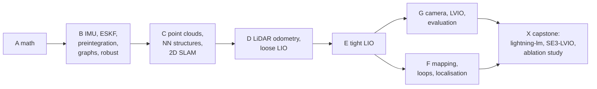
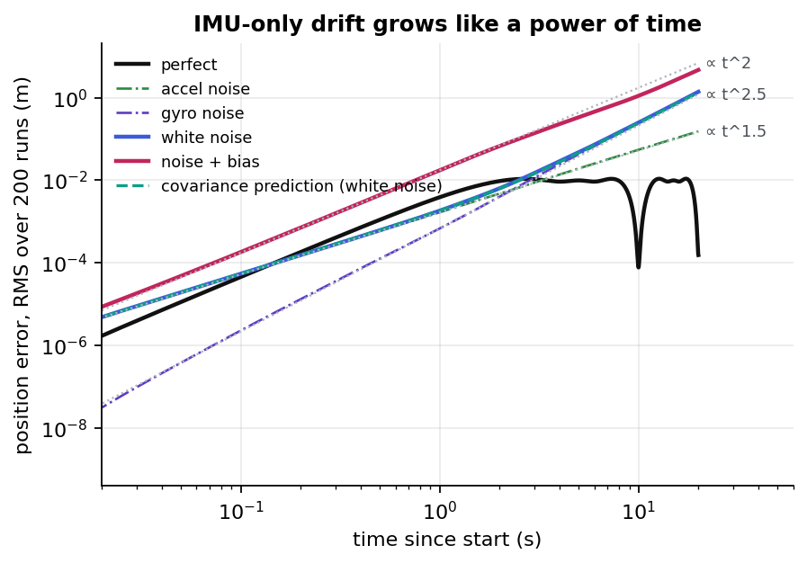
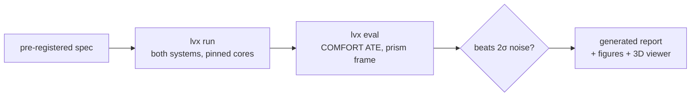

# LVIO_exp

**What actually matters in LiDAR-inertial(-visual) odometry? A controlled, pre-registered ablation study of
[SE(3)-LVIO](https://github.com/url-kaist/se3-livom-comfort) and
[lightning-lm](https://github.com/gaoxiang12/lightning-lm) on GrandTour / COMFORT data.**

[](https://github.com/Munna-Manoj/LVIO_exp/actions/workflows/ci.yml)
[](https://munna-manoj.github.io/LVIO_exp/)
[](LICENSE)

> [!NOTE]
> Status: **foundation (M0)**. The harness, protocol and 20 experiment specs are in place; no
> experiment has run inside the harness yet, so this page shows no result numbers. See the
> [roadmap](ROADMAP.md).

---

## Two tracks, one codebase

- **The course:** learn LiDAR-visual-inertial SLAM step by step, following the book
  [*SLAM in Autonomous Driving*](https://github.com/gaoxiang12/slam_in_autonomous_driving):
  - from IMU-only through ESKF, preintegration, factor graphs and robust estimation;
  - then point clouds, LiDAR odometry and LIO;
  - then mapping and loop closure;
  - beyond the book to the camera (LVIO);
  - and a **capstone** on lightning-lm and SE(3)-LVIO.

  Every chapter has a Python track that runs without data, a C++ lab on the book's official code and
  datasets, and links to the ablations.
- **The study:** pre-registered ablations of SE(3)-LVIO and lightning-lm on real GrandTour data.





*From course chapter [B01](docs/learn/B01-imu-propagation.md): why every LIO system needs more than its IMU.*

## Why this repository exists

- **One protocol, two systems.** Both systems run on the same missions, cores, frame conversion and ATE code.
- **Every experiment is written before its data.** Question, hypothesis, prediction and decision rule are
  hashed (`spec.lock`) before the first run. Negative results stay.
- **Effects must beat noise.** A change counts only if it moves ATE by more than 2σ of run-to-run noise
  (EXP-000).
- **Every number traces back** to a run manifest: commits, config hash, container digest, host.



## Experiments

<!-- lvx:begin index -->
| ID | Question | Phase | Status | Verdict | Headline |
|---|---|---|---|---|---|
| [EXP-000](docs/experiments/EXP-000-baselines-and-noise-floor.md) | How large is run-to-run noise, and do the pre-repo baselines reproduce? | P0 | 🗒️ planned |  |  |
| [EXP-001](docs/experiments/EXP-001-chi2-gate-sweep.md) | How wide should the point-to-plane residual gate be? | P1 | 🗒️ planned |  |  |
| [EXP-002](docs/experiments/EXP-002-robust-kernels-iekf.md) | Does a robust kernel in the IEKF update beat hard gating alone? | P1 | 🗒️ planned |  |  |
| [EXP-003](docs/experiments/EXP-003-gnc-tls-iekf.md) | Does GNC-TLS annealed across IEKF iterations help? | P1 | 🗒️ planned |  |  |
| [EXP-004](docs/experiments/EXP-004-robust-photometric.md) | Does a robust kernel on photometric residuals make the camera useful? | P5 | 🗒️ planned |  |  |
| [EXP-005](docs/experiments/EXP-005-degeneracy-projection.md) | Does projecting out degenerate directions help SE(3)-LVIO? | P2 | 🗒️ planned |  |  |
| [EXP-006](docs/experiments/EXP-006-step-limits-cov-hygiene.md) | Do step limits and covariance hygiene change accuracy or only robustness? | P2 | 🗒️ planned |  |  |
| [EXP-007](docs/experiments/EXP-007-smoke-filter.md) | Does dropping weak, close returns remove smoke without hurting accuracy? | P3 | 🗒️ planned |  |  |
| [EXP-008](docs/experiments/EXP-008-keyframe-map-insertion.md) | Should the map be updated every scan or only at keyframes? | P3 | 🗒️ planned |  |  |
| [EXP-009](docs/experiments/EXP-009-se3-vs-so3xr3.md) | Does the coupled SE(3) retraction matter? | P4 | 🗒️ planned |  |  |
| [EXP-010](docs/experiments/EXP-010-state-17-vs-12.md) | Does estimating accelerometer bias and gravity online pay off? | P4 | 🗒️ planned |  |  |
| [EXP-011](docs/experiments/EXP-011-online-time-offset-lever-arm.md) | Can online estimation replace hand-fitted calibration? | P4 | 🗒️ planned |  |  |
| [EXP-012](docs/experiments/EXP-012-image-quality-gate.md) | Does skipping bad frames make the camera pay for itself? | P5 | 🗒️ planned |  |  |
| [EXP-013](docs/experiments/EXP-013-affine-brightness.md) | Does affine brightness compensation help the photometric update? | P5 | 🗒️ planned |  |  |
| [EXP-014](docs/experiments/EXP-014-drift-and-loop-closure.md) | Is there drift worth closing loops for? | P5 | 🗒️ planned |  |  |
| [EXP-015](docs/experiments/EXP-015-gnc-pgo-false-loops.md) | Does GNC protect the pose graph from false loops? | P6 | 🗒️ planned |  |  |
| [EXP-016](docs/experiments/EXP-016-point-budget-sweep.md) | How much accuracy does each millisecond buy? | P7 | 🗒️ planned |  |  |
| [EXP-017](docs/experiments/EXP-017-four-core-budget.md) | Do both systems hold 10 Hz and 20 Hz on four cores? | P7 | 🗒️ planned |  |  |
| [EXP-018](docs/experiments/EXP-018-stress-suite.md) | Which design choices matter when the data gets worse? | P6 | 🗒️ planned |  |  |
| [EXP-019](docs/experiments/EXP-019-lightning-tuning-fairness.md) | Is lightning-lm tuned fairly? | PX | 🗒️ planned |  |  |
| [EXP-020](docs/experiments/EXP-020-map-structure-speed.md) | Does the map data structure set the speed of SE(3)-LVIO? | P3 | 🗒️ planned |  |  |
<!-- lvx:end index -->

## The two systems

| | SE(3)-LVIO | lightning-lm (LIO frontend) |
|---|---|---|
| Filter | iterated ESKF, SE(3) pose retraction, 17-dim error state | iterated ESKF, SO(3)×R³, 12-dim (accel bias + gravity fixed) |
| Map | probabilistic voxel planes (VoxelMap) | iVox, 5-NN plane fit |
| Residual weight | point + plane covariance, 3σ gate | constant weight, degeneracy projection |
| Sensors | 2 LiDARs + IMU + camera (photometric) | 1 LiDAR + IMU |
| Backend | plane BA (HBA) + iSAM2 | loop closure + pose graph (not used here) |

## Explore

| | |
|---|---|
| 📊 [Experiment reports](docs/experiments/index.md) | question → setup → results → verdict |
| 🧭 [Roadmap](ROADMAP.md) | milestones and the experiment plan |
| 📚 [Learn](docs/learn/README.md) | the course, book-aligned. Start with [B01 IMU propagation](docs/learn/B01-imu-propagation.md) |
| 💾 [Get the data](docs/how-to/get-the-data.md) | official links for the SAD datasets and GrandTour |
| 💡 [Explanation](docs/explain/README.md) | e.g. [SE(3) vs SO(3)×R³](docs/explain/se3-vs-so3xr3.md), [outliers in an IEKF](docs/explain/outliers-in-an-iekf.md) |
| 🛠️ [How-to](docs/how-to/README.md) | set up, propose and run an experiment |
| 📐 [Protocol](docs/process/EXPERIMENT_PROTOCOL.md) | the rules every experiment follows |

## Quick start

```bash
git clone --recurse-submodules git@github.com:Munna-Manoj/LVIO_exp.git && cd LVIO_exp
pip install -e ".[dev]"
lvx init --data-root ~/datasets/lvx --run-root ~/lvx_runs   # this machine only (git-ignored lvx.local.yaml)
lvx data check                     # which datasets are ready, and which chapters use them
lvx exp list                       # the experiment plan
python tools/check_experiments.py  # check_experiments: OK (20 experiments)
```

Running experiments needs the GrandTour data and the compute host: see [Set up](docs/how-to/setup.md).

## Credits

- **SE(3)-LVIO** (COMFORT entry, GPL-2.0) builds on VoxelMap, FAST-LIVO2 and HBA from HKU MARS.
- **lightning-lm** by Gao Xiang et al. It has no licence, so it is fetched at build time and never
  redistributed ([ADR-0003](docs/process/decisions/ADR-0003-system-inclusion-and-licences.md)).
- **Course backbone:** [*SLAM in Autonomous Driving*](https://github.com/gaoxiang12/slam_in_autonomous_driving)
  by Gao Xiang et al. (code MIT; the book is linked, never copied).
- **Data:** [GrandTour](https://grand-tour.leggedrobotics.com/) and the COMFORT localization benchmark, plus the
  SAD datasets (NCLT, UrbanLoco, UTBM, WXB, 2dmapping, AVIA). See [Get the data](docs/how-to/get-the-data.md).
- **Repository structure and writing guide:** adapted from [DS-MSP](https://github.com/Munna-Manoj/DS-MSP).

## License

MIT for this repository's own code and docs ([LICENSING.md](LICENSING.md)). The systems under test keep
their own licences.
