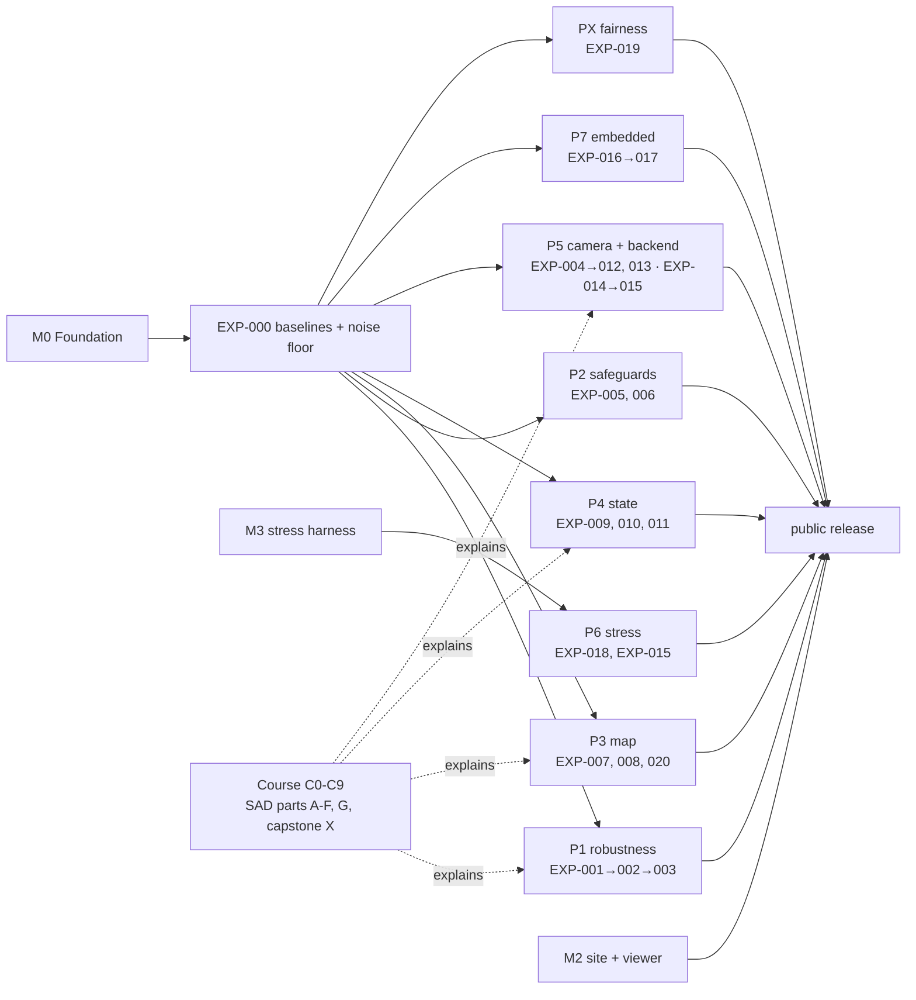

# Roadmap

The single plan for this repository. Every milestone (`M*`), course milestone (`C*`), chapter (`F*`/`I*`)
and experiment (`EXP-*`) has a status here.
Update it **in the same commit** as the work it describes (CLAUDE.md §10).

Status legend:
- ⬜ not started
- 🟨 in progress
- ✅ done
- ⛔ dropped (with reason)

Experiment status lives in each spec and is mirrored in the [registry](experiments/registry.md).

## Milestones

### M0 — Foundation (the harness can be trusted)

| ID | Task | Status | Done when |
|---|---|---|---|
| M0.1 | Repo skeleton, CLAUDE.md, protocol, checkers, CI | ✅ | `check_*` + pytest green |
| M0.2 | Fork `url-kaist/se3-livom-comfort` → `Munna-Manoj/se3-livom-comfort`, branch `lvio-exp`, add as submodule `systems/se3-lvio` | ⬜ | `git submodule status` shows the pinned commit |
| M0.3 | Clone this repo on the reference host, `pip install -e .[eval]`, set `LVX_DATA_ROOT`/`LVX_RUN_ROOT` | ⬜ | `lvx run EXP-000 --dry-run` prints a manifest on the host |
| M0.4 | Build lightning-lm via `scripts/build_lightning.sh` (pinned 1325fed + our runner with `--timing`) | ⬜ | `bin/run_lio_tum` exists, timing.csv written |
| M0.5 | Fix the mission split: confirm the six COMFORT Validation missions, download 5 more, convert to the offline layout + lightning bags | ⬜ | `configs/missions.yaml` has `dev` (3) and `test` (3) with GT, ADR-0005 updated |
| M0.6 | EXP-000: baselines + noise floor | ⬜ | EXP-000 concluded `adopt` |

### M1 — First results (one complete phase, publishable)

| ID | Task | Status |
|---|---|---|
| M1.1 | Implement flags `residual_gate_sigma`, `robust_kernel` (none/huber/cauchy/gnc_tls) in the fork | ⬜ |
| M1.2 | EXP-001 → EXP-002 → EXP-003 (the GNC question) | ⬜ |
| M1.3 | Explanation page "Outliers in an IEKF" updated with the measured answer | ⬜ |

### M2 — Public site and viewer

| ID | Task | Status |
|---|---|---|
| M2.1 | MkDocs site builds strict, GitHub Pages workflow | ⬜ |
| M2.2 | `web/` three.js viewer: decimated map + GT/estimates, deep links `?exp=&mission=` | ⬜ |
| M2.3 | README hero: animated map + trajectory GIF generated by script from EXP-000 | ⬜ |
| M2.4 | Learn track chapters 1-4 (see docs/learn/README.md) | ⬜ |

### M3 — Stress harness

| ID | Task | Status |
|---|---|---|
| M3.1 | Data-side stress profiles from `configs/stress.yaml` in lvx (scan drop, thinning, Livox off, IMU shift) | ⬜ |
| M3.2 | False-loop injection for the backend (needs EXP-014 flag) | ⬜ |

### Course milestones (CLAUDE.md §11, curriculum in course/curriculum.yaml)

The course follows the SAD book (parts A–F), with 🔗 bridge chapters I01–I07 placed where the book stops
short of what the real systems need. It then goes beyond the book (G) and ends in the capstone (X). Each block
unlocks the experiments it explains. Chapter status lives in `course/curriculum.yaml`.

| ID | Chapters | SAD | Status | Explains |
|---|---|---|---|---|
| C0 | Infrastructure: `lvio_course`, chapter contract, `sync_course.py`, curriculum.yaml, `lvx lab` + `lvx data`, ADR-0007/0008 | – | ✅ | – |
| C1 | A01 rotations & poses, A02 Kalman filters, **B01 IMU propagation ✅** (lab verified), 🔗 I01 real IMUs & Allan variance, B02 ESKF-GINS, 🔗 I02 time offsets & extrinsics | ch2–3 | 🟨 | EXP-009, EXP-010, EXP-011 |
| C2 | B03 preintegration, B04 factor graphs, B05 robust estimation (the GNC chapter) | ch4 + | ⬜ | EXP-001–003, EXP-014, EXP-015 |
| C3 | C01 point clouds, **C02 nearest-neighbour structures & speed**, C03 fitting, C04–C05 2D SLAM | ch5–6 | ⬜ | EXP-008, EXP-016, EXP-020 |
| C4 | D01 ICP, D02 NDT, D03 LiDAR odometry, 🔗 I03 degeneracy, D04 loosely coupled LIO | ch7 | ⬜ | EXP-005, EXP-006 |
| C5 | E01 IEKF = Gauss-Newton, E02 tightly coupled LIO, 🔗 I04 map structures in the loop, 🔗 I05 multi-LiDAR fusion, E03 preintegration LIO | ch8 | ⬜ | EXP-001, EXP-006, EXP-008–010, EXP-016, EXP-020 |
| C6 | F01 offline mapping, F02 loop closure, 🔗 I06 online smoothing backend, 🔗 I07 dynamic objects & map hygiene, F03 map localisation | ch9–10 | ⬜ | EXP-007, EXP-014, EXP-015 |
| C7 | G01 photometric alignment, G02 LVIO, G03 evaluation | beyond | ⬜ | EXP-000, EXP-004, EXP-012, EXP-013 |
| C8 | Capstone: X01 lightning-lm, X02 SE(3)-LVIO, X03 running the study, X04 your own experiment | – | ⬜ | all |
| C9 | Verify every SAD lab once (`lvx lab run`, 21 labs; 1 verified) | ch3–10 | 🟨 | – |

Suggested interleaving with the study:
- C1 + C2 alongside M0 (C2 answers the GNC question in theory before EXP-001–003 test it);
- C3 before EXP-020;
- C5 before P2/P4;
- C7 + C8 alongside P5 and the final write-up.

### M4 — Remaining phases

| ID | Task | Status |
|---|---|---|
| M4.1 | P2 safeguards: EXP-005, EXP-006 | ⬜ |
| M4.2 | P3 map: EXP-007, EXP-008, EXP-020 | ⬜ |
| M4.3 | P4 state: EXP-009, EXP-010, EXP-011 | ⬜ |
| M4.4 | P5 camera + backend: EXP-004, EXP-012, EXP-013, EXP-014, EXP-015 | ⬜ |
| M4.5 | P6 stress: EXP-018 | ⬜ |
| M4.6 | P7 embedded: EXP-016, EXP-017 (+ real Pi 5 run if hardware is available) | ⬜ |
| M4.7 | PX fairness: EXP-019 | ⬜ |
| M4.8 | Final write-up page: what mattered, what didn't, the combined best configuration on `test` | ⬜ |

## Experiment catalogue

Specs are drafted (`planned`). Each needs user approval + `lvx exp freeze` before it runs.

| ID | Question | Phase | Depends on |
|---|---|---|---|
| EXP-000 | Run-to-run noise and baseline reproduction | P0 | – |
| EXP-001 | Width of the point-to-plane gate | P1 | EXP-000 |
| EXP-002 | Huber / Cauchy IRLS inside the IEKF | P1 | EXP-001 |
| EXP-003 | GNC-TLS annealed over IEKF iterations | P1 | EXP-002 |
| EXP-004 | Robust photometric residuals | P5 | EXP-000 |
| EXP-005 | Degeneracy projection (from lightning-lm) | P2 | EXP-000 |
| EXP-006 | Step limits + covariance hygiene (from lightning-lm) | P2 | EXP-000 |
| EXP-007 | Smoke filter (intensity + range) | P3 | EXP-000 |
| EXP-008 | Keyframe-only map insertion (from lightning-lm) | P3 | EXP-000 |
| EXP-009 | SE(3) vs SO(3)×R³ retraction | P4 | EXP-000 |
| EXP-010 | 17-dim vs 12-dim state | P4 | EXP-000 |
| EXP-011 | Online IMU time offset | P4 | EXP-000 |
| EXP-012 | Image quality gate | P5 | EXP-004 |
| EXP-013 | Affine brightness compensation | P5 | EXP-004 |
| EXP-014 | Drift check + loop closure in the backend | P5 | EXP-000 |
| EXP-015 | GNC pose graph under injected false loops | P6 | EXP-014 |
| EXP-016 | Point budget: accuracy vs time | P7 | EXP-000 |
| EXP-017 | Four-core real-time budget, both systems | P7 | EXP-016 |
| EXP-018 | Stress suite, both systems | P6 | EXP-000 |
| EXP-019 | Fair tuning budget for lightning-lm | PX | EXP-000 |
| EXP-020 | Does the map data structure set the speed? (VoxelMap vs iVox inside SE(3)-LVIO) | P3 | EXP-000, EXP-016 |

## Backlog (not planned yet; needs a spec before work)

- Free-space carving / dynamic-object removal in the voxel map.
- SE₂(3) invariant-EKF variant (third arm of EXP-009).
- Camera-coloured map export for the viewer.
- Real Raspberry Pi 5 run (needs hardware and its host profile).
