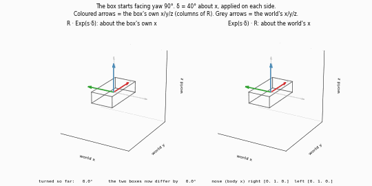
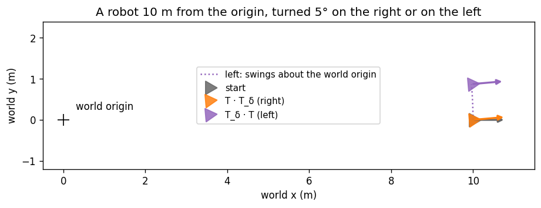
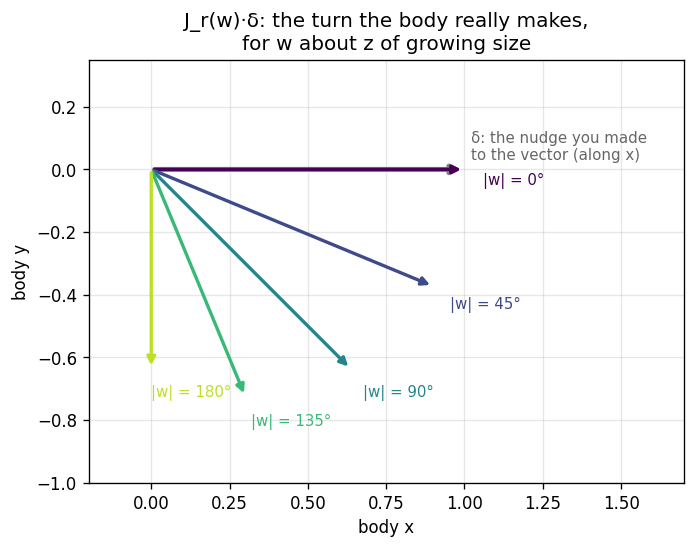
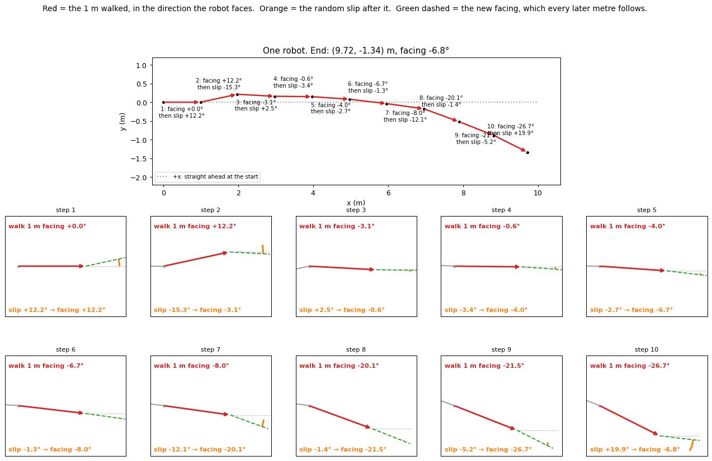
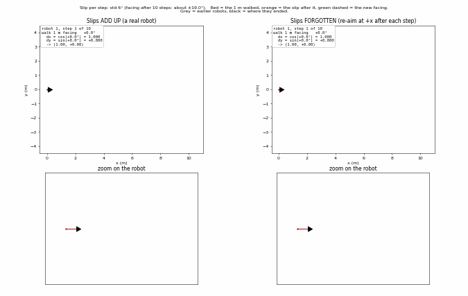
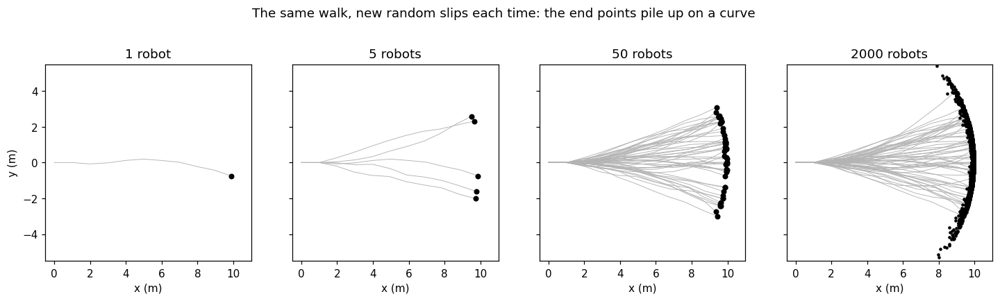
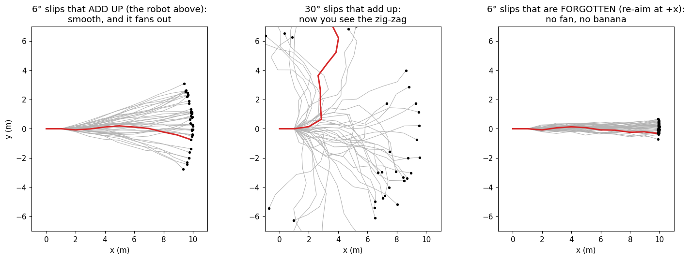
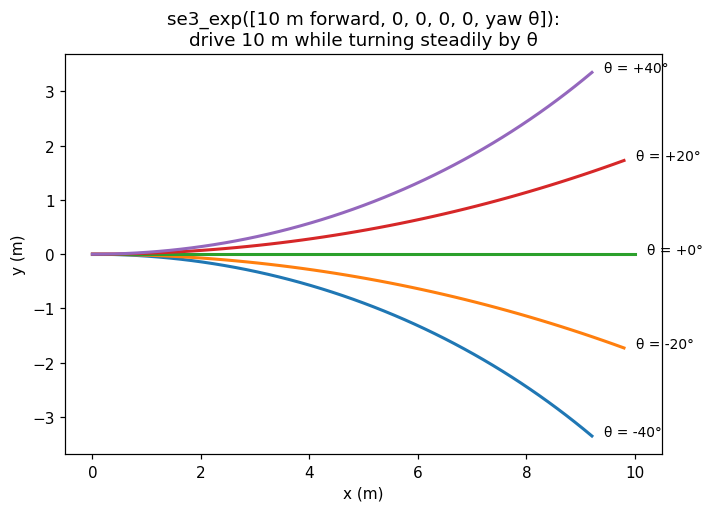
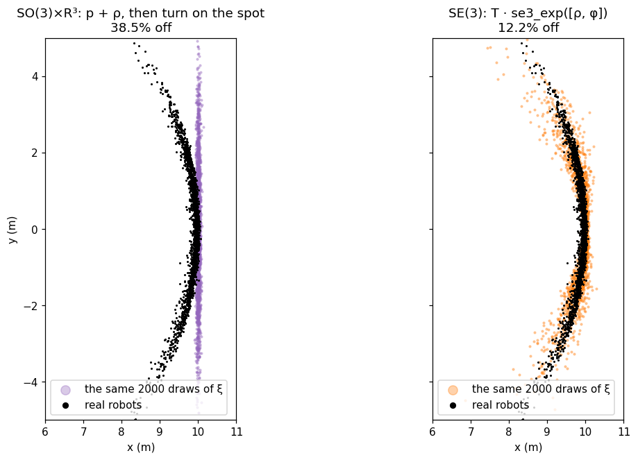
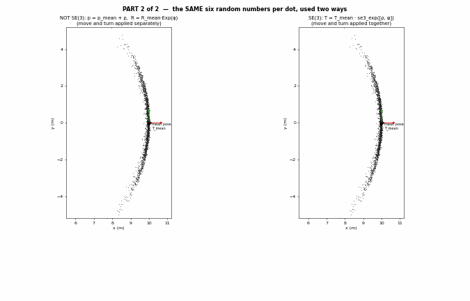

# A01 — Rotations and poses: SO(3), SE(3), Exp/Log, perturbations, Jacobians

Three short lessons, for readers who know matrices and vectors. **Lesson 1:** a small turn can go on two
sides of a rotation, and they differ. **Lesson 2:** nudging a rotation vector is not the nudge you think.
**Lesson 3:** why a robot's position uncertainty is shaped like a banana, and what "on SE(3)" means. No
dataset is needed.

> [!NOTE]
> **Book companion:** *SLAM in Autonomous Driving*, chapter 2
> ([English PDF](https://github.com/gaoxiang12/slam-in-ad-en/blob/main/sad-en.pdf)). Read the book for the
> full derivations; this chapter builds the ideas one picture at a time.
>
> **Same code as DS-MSP.** `so3.py` and `se3.py` are copied verbatim from
> [DS-MSP](https://github.com/Munna-Manoj/DS-MSP) (`ds_msp/core/lie.py`), the same author's camera library,
> so the maths reads the same in both. `tools/check_lie.py` keeps the copies identical.


## Why you should care

A LiDAR-inertial filter does three things with rotations, about a hundred times a second:
- it **turns** its estimate by a small amount (a gyro reading, or a correction);
- it asks **how a small change** in its numbers moves the robot (a Jacobian);
- it keeps a **bell curve** of how wrong it might be (a covariance).

Each step hides a trap that numbers on a line don't have. A wrong side, a missing Jacobian or the wrong
shape of bell curve gives a filter that drifts or claims a certainty it doesn't have. This chapter shows
each trap with a picture, then the fix.

## What you need first

- **A rotation matrix** $`R`$ (3×3) turns body coordinates into world coordinates: $`p_w = R\,p_b`$. Its
  columns are the body's own x, y and z axes, written in world coordinates.
- **A matrix product is read right to left**, the way a point travels through it: in $`A\,B\,p`$, the point
  meets $`B`$ first.
- **A bell curve** (a Gaussian) is described by its centre (mean) and its spread (covariance). Drawing a
  "sample" means picking random numbers from it. Lesson 3 needs only this.
- Python with NumPy, SciPy and Matplotlib.

## What you will build

| File | What it does |
|---|---|
| [`so3.py`](so3.py) | Rotations: `hat` (Eq. 1), `so3_exp` (Eq. 2), `so3_log` (Eq. 3), the right Jacobian (Eq. 6) |
| [`se3.py`](se3.py) | Poses: `se3_exp` (Eq. 7), `se3_adjoint` (Eq. 8), driving with noise (Eq. 9), predicting the spread (Eq. 10) |
| [`lesson1_sides.py`](lesson1_sides.py) | Lesson 1: the box turned on its own axes or the world's, and a pose that swings |
| [`lesson2_jacobian.py`](lesson2_jacobian.py) | Lesson 2: nudging a rotation vector, with and without $`J_r`$ |
| [`lesson3_walk.py`](lesson3_walk.py) | Lesson 3: one robot step by step, then 2000, then what `se3_exp` does |
| [`lesson3_banana.py`](lesson3_banana.py) | Lesson 3: two bell curves for the cloud, the same numbers through SO(3)×R³ and SE(3), the knob |
| [`main.py`](main.py) | Runs all three lessons, prints the numbers quoted below, writes `results/` |
| [`live_box.py`](live_box.py), [`live_walk.py`](live_walk.py), [`live_dots.py`](live_dots.py) | Animations, one per idea, with knobs on the command line |

```bash
cd course/chapters/A01-rotations-and-poses
python main.py          # about 12 s
python live_walk.py     # opens a window; space pauses
```

## Lesson 1 — Which side? The body's own axes or the world's

### The question

A drone faces north. You tell it "roll 40° about x". About **its own** x axis (its nose), or about the
**world's** x axis (east)? Both make sense, and a rotation matrix makes you choose: the small turn
$`\mathrm{Exp}(\delta)`$ goes either on the right of $`R`$ or on the left.

### Step by step

Read each product right to left, with $`p_b`$ a point of the body:
- $`R\,\mathrm{Exp}(\delta)\,p_b`$: the point is turned **while still in body coordinates**, then carried to
  the world. So $`\delta`$ is about the body's own axes.
- $`\mathrm{Exp}(\delta)\,R\,p_b`$: the point is carried to the world **first**, then turned. So $`\delta`$
  is about the world's axes.

Follow the box's nose, body point $`(1, 0, 0)`$. The box starts yawed 90°, so it faces world +y. Then
$`\delta`$ = 40° about x:

| | nose in world coordinates |
|---|---|
| start | (0.00, 1.00, 0.00) |
| right, $`R\,\mathrm{Exp}(\delta)`$: turn about the nose itself | (0.00, 1.00, 0.00): the nose stays, the box **rolls** |
| left, $`\mathrm{Exp}(\delta)\,R`$: turn about world x | (0.00, 0.77, 0.64): the nose lifts, the box **pitches** |



*`python live_box.py`: the turn grows from 0 to 40°. Coloured arrows are the box's own axes, grey arrows the
world's.*

### Two ways, side by side


*Same numbers, different turns: the two results are 56.0° apart.*

A **pose** $`T = \begin{bmatrix} R & t \\ 0 & 1 \end{bmatrix}`$ has the same two sides, with one more
surprise. A turn on the left is about the **world origin**, so it swings the robot's position too:



*A robot 10 m from the origin, turned 5°. On the right it moves 0.00 m (it turns in place). On the left it
moves 0.87 m.*

### The maths

A rotation vector $`w`$ (axis × angle, in radians) is first written as the matrix of the cross product:

```math
[w]_\times = \begin{bmatrix} 0 & -w_3 & w_2 \\ w_3 & 0 & -w_1 \\ -w_2 & w_1 & 0 \end{bmatrix}, \quad [w]_\times v = w \times v \qquad (1)
```

The exponential map turns it into a rotation matrix (Rodrigues' formula), with $`\theta = \lVert w \rVert`$
the angle:

```math
\mathrm{Exp}(w) = I + \frac{\sin\theta}{\theta}[w]_\times + \frac{1-\cos\theta}{\theta^2}[w]_\times^2 \qquad (2)
```

The logarithm goes back from a matrix to a vector. `so3_log` also handles $`\theta \approx 0`$ and
$`\theta \approx \pi`$, where this formula divides by zero:

```math
\theta = \arccos\frac{\mathrm{tr}(R) - 1}{2}, \quad w = \frac{\theta}{2\sin\theta}\,(R - R^\top)^\vee \qquad (3)
```

The two sides, for a small turn $`\delta`$ and a body-to-world $`R`$:

```math
R \leftarrow R\,\mathrm{Exp}(\delta) \;\;\text{(right: body axes)}, \qquad R \leftarrow \mathrm{Exp}(\delta)\,R \;\;\text{(left: world axes)} \qquad (4)
```

They are related exactly: a body-axis turn equals the world-axis turn about the same axis written in world
coordinates, $`R\,\delta`$. Eq. 5 holds to 1.3e-15 in the code:

```math
R\,\mathrm{Exp}(\delta) = \mathrm{Exp}(R\,\delta)\,R \qquad (5)
```

> [!IMPORTANT]
> This course puts corrections on the **right**: a gyro measures in the body's axes, and both systems
> studied here (SE(3)-LVIO and lightning-lm) correct their state on the right. When you need the other
> side, use Eq. 5 (or Eq. 8 for poses).

### Turn the knob

How the box faces before the turn decides how far apart the two sides end (40° about x):

| box faces (yaw) | 0° | 30° | 60° | 90° | 180° |
|---|---|---|---|---|---|
| right vs left | 0.0° | 20.3° | 39.4° | 56.0° | 80.0° |

At yaw 0° the box's axes *are* the world's, so the sides agree. Try `python live_box.py --start-yaw 0`, or
`--axis z`: a turn about z commutes with a yaw, so the sides agree again.

### Misconceptions

- **"Left is local, right is global."** It is the other way round for $`T_{w b}`$ (body to world,
  $`p_w = T\,p_b`$). A perturbation sits next to the frame it is written in:
  $`T_{w b}\,\mathrm{Exp}(\delta)`$ has $`\delta`$ in $`b`$, the body.
- **"For a small turn the side doesn't matter."** Both results are close to $`R`$, but they are different
  turns, about different axes. The difference is comparable to the turn itself (56.0° for a 40° turn).
- **"A left turn of a pose turns the robot in place."** It swings it about the world origin: 0.87 m for 5°
  at 10 m.

### Check yourself

1. A gyro reads $`\omega`$ (rad/s) for $`\Delta t`$ seconds. On which side does $`\mathrm{Exp}(\omega\,\Delta t)`$ go?
   <details><summary>Answer</summary>The right: $`R \leftarrow R\,\mathrm{Exp}(\omega\,\Delta t)`$. A gyro is
   fixed to the body and measures about the body's own axes.</details>
2. In `turned` (`lesson1_sides.py`), make the left side give the same box as the right. What do you change?
   <details><summary>Answer</summary>Use $`R\,\delta`$ instead of $`\delta`$ on the left:
   $`\mathrm{Exp}(R\,\delta)\,R`$. That is Eq. 5.</details>

## Lesson 2 — Nudging a rotation vector: the right Jacobian

### The question

An optimiser stores a rotation as a vector $`w`$ and changes it a little, $`w \to w + \delta`$. By how much,
and about which axis, does the body really turn? The easy guess is "by $`\delta`$". That is exact for
numbers on a line, and wrong for 3-D rotations.

### Step by step

Take $`w`$ = 90° about z, and nudge the vector by 0.01 along x. The body really turns by
(+0.00637, -0.00637, +0.00001). That is 0.90 times as much as the nudge, about an axis tilted -45.0°:
half of the 90° rotation.



*The grey arrow is the nudge you made to the vector (along x). Each coloured arrow is the turn the body
really makes, for a bigger $`w`$. Lengths: 1.00 at 0°, 0.97 at 45°, 0.90 at 90°, 0.78 at 135°, 0.64 at 180°.*

### Two ways, side by side


*Nudge by $`|\delta| = 0.001`$, and compare with the exact $`\mathrm{Exp}(w + \delta)`$. Pretending the body
turns by $`\delta`$ is off by 0.069 of the nudge at 10°, 0.405 at 60° and 0.91 at 170°. With $`J_r`$ the error
at 60° is 0.00007: what is left is second order.*

### The maths

The right Jacobian $`J_r(w)`$ converts a nudge of the vector into the turn of the body, on the right:

```math
\mathrm{Exp}(w + \delta) \approx \mathrm{Exp}(w)\,\mathrm{Exp}(J_r(w)\,\delta), \quad J_r(w) = I - \frac{1-\cos\theta}{\theta^2}[w]_\times + \frac{\theta - \sin\theta}{\theta^3}[w]_\times^2 \qquad (6)
```

> $`\theta = \lVert w \rVert`$. For $`w`$ about z and $`\delta`$ along x, $`J_r\,\delta`$ is $`\delta`$ turned by
> $`-\theta/2`$ and shortened by $`\sin(\theta/2)/(\theta/2)`$: the arrows above.

### Turn the knob

Nudge along $`w`$'s own axis instead (60° about an axis, then a little more about the same axis). Without
$`J_r`$ the error is 0.00000: turns about **one** axis add like numbers. That is why 2-D (yaw only) never
needs $`J_r`$, and why 3-D does.

### Misconceptions

- **"$`\mathrm{Exp}(a + b) = \mathrm{Exp}(a)\,\mathrm{Exp}(b)`$, like $`e^{a+b} = e^a e^b`$."** Only when
  $`a`$ and $`b`$ share an axis.
- **"$`J_r`$ only matters for huge rotations."** At 10° the error is already 0.069 of the nudge.
- **"The optimiser will fix a small error anyway."** It converges slowly or not at all. DS-MSP's solver
  re-bases the rotation after every step, keeping $`w`$ small.

### Check yourself

1. A robot only turns about z (yaw). Does its filter need $`J_r`$ for the yaw?
   <details><summary>Answer</summary>No. Every change is about the same axis, so turns add like numbers and
   $`J_r = 1`$. This is the knob above.</details>
2. $`w`$ = 180° about z, nudge along x. How much does the body turn, compared with the nudge?
   <details><summary>Answer</summary>0.64 of it, about an axis turned by -90°: along -y (the last arrow in
   the figure).</details>

## Lesson 3 — Uncertainty on poses: the banana, and what "on SE(3)" means

### The question

A robot walks blindfolded: 10 steps of 1 m, trying to go straight. After each step it slips by a small
random turn (a bell curve with a spread of 6°). **Where does it end?** And how should a filter describe
"where it might be" with one bell curve?

### Step by step

One robot. Each step: walk 1 m the way you face, then slip.

| step | facing while walking | then slip | facing after | corner reached |
|---|---|---|---|---|
| 1 | +0.0° | +12.2° | +12.2° | (1.00, 0.00) |
| 2 | +12.2° | -15.3° | -3.1° | (1.98, 0.21) |
| 3 | -3.1° | +2.5° | -0.6° | (2.98, 0.16) |
| 4 | -0.6° | -3.4° | -4.0° | (3.98, 0.15) |
| 5 | -4.0° | -2.7° | -6.7° | (4.97, 0.08) |
| 6 | -6.7° | -1.3° | -8.0° | (5.97, -0.04) |
| 7 | -8.0° | -12.1° | -20.1° | (6.96, -0.18) |
| 8 | -20.1° | -1.4° | -21.5° | (7.90, -0.52) |
| 9 | -21.5° | -5.2° | -26.7° | (8.83, -0.89) |
| 10 | -26.7° | +19.9° | -6.8° | (9.72, -1.34) |

The slips **add up**. After step 7 the robot faces -20.1°, so every later metre carries it down. The +19.9°
at the end turns it back, but the metres already walked are not returned.





*`python live_walk.py`: the same slips on both sides. Left: they add up (a real robot). Right: each slip is
forgotten and the robot re-aims at +x.*

### Many at once



Repeat with new random slips each time. A robot that ends far to the side faced away from +x for many
metres, so it also made less progress in x. The end points pile up on a curve, the **banana**:
- facing spread ±19.2°, end y ±1.70 m;
- distance from the start 9.91 ± 0.08 m: almost fixed;
- x as low as 7.26 m: the ends curl back.



*Why the paths look smooth: a 6° slip is a small kink, and it changes where the robot faces **from then on**.
If each slip were forgotten (right), the robots would end within y ±0.31 m: no fan, no banana.*

### Two ways, side by side

A filter can't simulate 2000 robots. It keeps one bell curve. Two recipes make "guesses" from one:

- **A: a bell curve in x and y** (blue). Draw x and y, put a dot there. It is even **fitted** to the real
  robots (x 9.76 ± 0.28 m, y ± 1.70 m). Its centre, the x–y average, is 3.7 cm from the nearest robot: in the
  empty middle of the curve.
- **B: a bell curve over a move and a turn** (orange). Draw six numbers $`\xi = [\rho, \phi]`$, then drive
  from the noise-free end pose with `se3_exp`. This bell curve is **predicted** by Eq. 10, without the
  robots.

Off the cloud: A 50.0%, B 12.2% (the figure at the top of the page).

What does `se3_exp` do with those numbers? It **drives while turning steadily**:



*10 m while turning 20° ends at (9.80, 1.73); turning 40° ends at (9.21, 3.35). The arcs bend back, like the
robots.*

Now the decisive test: **the same six random numbers**, applied two ways (Eq. 11).
- **SO(3)×R³:** add the move to the position, and turn on the spot.
- **SE(3):** one `se3_exp`, so the turn bends the move.





One draw: forward -0.01 m, sideways -2.81 m, yaw -27.6°. SO(3)×R³ puts the robot at (9.99, -2.81), off the
cloud. SE(3) puts it at (9.33, -2.70), on it. Over 2000 draws: SO(3)×R³ 38.5% off, SE(3) 12.2%.

*`python live_dots.py`: part 1 makes each blue and orange dot one at a time; part 2 is this test.*

### The maths

A pose has a tangent vector $`\xi = [\rho, \phi]`$, translation part first (the DS-MSP order). Its
exponential couples the two through the left Jacobian $`J_l(\phi) = J_r(\phi)^\top`$. That coupling is the
bend:

```math
\mathrm{Exp}(\xi) = \begin{bmatrix} \mathrm{Exp}(\phi) & J_l(\phi)\,\rho \\ 0 & 1 \end{bmatrix} \qquad (7)
```

The adjoint is Eq. 5 for poses: it moves a perturbation from one side of $`T`$ to the other.

```math
T\,\mathrm{Exp}(\xi) = \mathrm{Exp}(\mathrm{Ad}_T\,\xi)\,T, \quad \mathrm{Ad}_T = \begin{bmatrix} R & [t]_\times R \\ 0 & R \end{bmatrix} \qquad (8)
```

The robot walks $`N`$ steps $`u`$ (1 m forward), and after each it slips by noise
$`w_k \sim \mathcal{N}(0, Q)`$ in its own frame. The cos/sin walk above is this with only a yaw slip; the
two agree to 4e-16 m:

```math
T_{k+1} = T_k\,\mathrm{Exp}(u)\,\mathrm{Exp}(w_k) \qquad (9)
```

Write the true pose as the noise-free pose $`\bar T_k`$ times an error, $`T_k = \bar T_k\,\mathrm{Exp}(\xi_k)`$.
Eq. 8 carries the old error past the step $`U = \mathrm{Exp}(u)`$, so, to first order, its covariance grows as:

```math
\Sigma_{k+1} = \mathrm{Ad}_{U^{-1}}\,\Sigma_k\,\mathrm{Ad}_{U^{-1}}^\top + Q \qquad (10)
```

> No random numbers are needed. After 10 steps Eq. 10 predicts forward ±0.032 m, sideways ±1.77 m and
> yaw ±19.0°. Its $`[t]_\times`$ block turns a heading error into a sideways error after the next metre.

The two ways of applying a draw $`\xi`$ to the mean pose $`(\bar R, \bar p)`$:

```math
\text{SO(3)×R³:}\;\; \bar p + \rho,\;\; \bar R\,\mathrm{Exp}(\phi) \qquad\quad \text{SE(3):}\;\; \bar T\,\mathrm{Exp}(\xi),\ \text{position}\ \bar p + \bar R\,J_l(\phi)\,\rho \qquad (11)
```

How good is Eq. 10? Monte Carlo / predicted covariance: total 1.00, lateral 0.99. Along the track the real
spread is 27.6 times the prediction. Forward error also comes from products of two errors (a heading error
times a sideways error), which a first-order model drops.

### Turn the knob

The yaw slip per step, and how often a draw lands off the cloud:

| yaw slip per step | facing doubt after 10 m | SO(3)×R³ off | SE(3) off |
|---|---|---|---|
| 0.5° | ± 1.6° | 0.9% | 1.1% |
| 1.0° | ± 3.2° | 1.7% | 1.5% |
| 2.0° | ± 6.3° | 7.5% | 1.7% |
| 6.0° | ±19.0° | 33.5% | 9.0% |
| 10.0° | ±31.6° | 44.8% | 13.5% |

With a few degrees of heading doubt or less, the banana is straight and the two models **agree**. A LiDAR
filter corrects its pose every 0.1 s, so between corrections its heading doubt stays far below a degree:
the top row. Try `python live_walk.py --turn-std 1`.

### Misconceptions

- **"The x–y average is where the robot most likely is."** It sits in the empty middle of the curve, 3.7 cm
  from the nearest robot.
- **"SO(3)×R³ is wrong, so filters built on it can't work."** Both store the same rotation and position
  exactly. They differ only in how a change is applied. For the small changes of each optimiser step they
  agree (the knob), and an optimiser recomputes its residuals after every step.
- **"SE(3) means polar coordinates."** No. `se3_exp` means "move while turning steadily", which also bends,
  and it carries the facing as well as the position.
- **"The banana is a 3-D effect."** The yaw slip alone makes it (the cos/sin walk). Roll and pitch move the
  robot up and down, which the top view doesn't show.
- **"Eq. 10 is exact."** It is first order: along the track the real spread is 27.6 times the prediction.

### Check yourself

1. The yaw slip is 1° per step. Which model should a filter use for the position?
   <details><summary>Answer</summary>Either: 1.7% off for SO(3)×R³ and 1.5% for SE(3). With small heading
   doubt the banana is straight.</details>
2. Why do almost no grey paths cross after the first few metres?
   <details><summary>Answer</summary>A slip changes where the robot faces from then on. A robot that drifted
   down tends to keep pointing down, so robots that are apart keep moving apart.</details>
3. A draw has a large sideways move and a large turn. Where does SO(3)×R³ put it, compared with SE(3)?
   <details><summary>Answer</summary>Straight sideways from the mean, at the full forward distance (like
   (9.99, -2.81)). SE(3) bends it back toward the start (like (9.33, -2.70)), where real robots are.</details>

## Build it

Open the files in this order; each block is commented with the equation it implements.

1. **[`so3.py`](so3.py): `hat`, `so3_exp`, `so3_log`.** Eq. 1, 2 and 3. The small-angle branches are the
   Taylor series, so nothing divides by zero. Near 180° the axis comes from $`(R + I)/2 \approx a a^\top`$.
2. **[`lesson1_sides.py`](lesson1_sides.py).** `turned` is Eq. 4. `scene_box` checks Eq. 5 on 1000 random
   rotations. `scene_pose` turns a 4×4 pose on each side.
3. **`so3_right_jacobian` in `so3.py`, then [`lesson2_jacobian.py`](lesson2_jacobian.py).** Eq. 6.
   `body_turn` measures the true turn; `scene_error` compares it with and without $`J_r`$.
4. **[`se3.py`](se3.py): `se3_exp`, `se3_adjoint`, `drive`, `propagate_covariance`.** Eq. 7 to 10, built
   from the `so3.py` functions.
5. **[`lesson3_walk.py`](lesson3_walk.py).** `walk` is the cos/sin robot; `walk_se3` is the same robot with
   Eq. 9. Then 2000 robots, and `se3_exp` as an arc.
6. **[`lesson3_banana.py`](lesson3_banana.py).** `separate` and `together` are the two sides of Eq. 11.
   `scene_recipes` makes the two figures; `scene_knob` the table.
7. **[`main.py`](main.py)** runs it all. The animations (`live_*.py`) reuse the lesson files and only draw.

"Off the cloud" means farther from every real robot than 99% of the robots are from their nearest neighbour.

Output (`results/output.txt`):

```text
LESSON 1  which side: the box faces +y, delta = 40 deg about x
  nose at the start (0.00, 1.00, 0.00), after R·Exp(δ) (0.00, 1.00, 0.00), after Exp(δ)·R (0.00, 0.77, 0.64)
  the two results are 56.0° apart; Eq. 5 converts one into the other to 1.3e-15
  knob, how the box faces before the turn -> gap: 0° 0.0°, 30° 20.3°, 60° 39.4°, 90° 56.0°, 180° 80.0°
  a pose 10 m from the origin, turned 5°: on the right it moves 0.00 m, on the left 0.87 m
LESSON 2  nudge the rotation vector w = 90 deg about z by 0.01 along x
  the body really turns by (+0.00637, -0.00637, +0.00001): 0.90 times as much, tilted -45.0°; J_r predicts (+0.00637, -0.00637, +0.00000)
  length of J_r·δ for |w| = 0° 1.00, 45° 0.97, 90° 0.90, 135° 0.78, 180° 0.64
  error / |δ| without J_r: 0.069 at 10°, 0.405 at 60°, 0.91 at 170°; with J_r 0.00007 at 60°
  knob, nudge along w's own axis at 60°: 0.00000 without J_r
LESSON 3  one robot, 10 x (walk 1 m, then slip by a random turn, std 6 deg)
  slips (deg): +12.2 -15.3 +2.5 -3.4 -2.7 -1.3 -12.1 -1.4 -5.2 +19.9
  facing after each slip (deg): +12.2 -3.1 -0.6 -4.0 -6.7 -8.0 -20.1 -21.5 -26.7 -6.8
  corners: (1.00, 0.00) (1.98, 0.21) (2.98, 0.16) (3.98, 0.15) (4.97, 0.08) (5.97, -0.04) (6.96, -0.18) (7.90, -0.52) (8.83, -0.89) (9.72, -1.34)
  cos/sin and se3_exp (Eq. 9) agree to 4e-16 m
2000 robots: facing spread ±19.2°, end y ±1.70 m, distance from the start 9.91 ± 0.08 m, x as low as 7.26 m
  slips forgotten instead of added up: end y ±0.31 m
  se3_exp, 10 m while turning 20°: ends at (9.80, 1.73); turning 40°: (9.21, 3.35)
the banana, 6-D noise per step (1 cm, 0.5° roll and pitch, 6° yaw):
  x 9.76 ± 0.28 m, y ± 1.70 m; the x-y average is 3.7 cm from the nearest robot
  off the cloud: A (bell curve in x-y, fitted) 50.0%, B (over xi, predicted) 12.2%
  the same draws of xi through SO(3)xR3 (Eq. 11 left): 38.5%
  one draw: forward -0.01 m, sideways -2.81 m, yaw -27.6° -> SO(3)xR3 (9.99, -2.81), SE(3) (9.33, -2.70)
  Eq. 10 predicts: forward ±0.032 m, sideways ±1.77 m, yaw ±19.0°
  Monte Carlo / predicted: total 1.00, lateral 0.99, along-track 27.6
knob, yaw noise per step -> facing doubt after 10 m -> off the cloud SO(3)xR3 / SE(3):
   0.5° -> ± 1.6° ->  0.9% /  1.1%
   1.0° -> ± 3.2° ->  1.7% /  1.5%
   2.0° -> ± 6.3° ->  7.5% /  1.7%
   6.0° -> ±19.0° -> 33.5% /  9.0%
  10.0° -> ±31.6° -> 44.8% / 13.5%
```

The GIFs are written by `python live_box.py --gif`, `python live_walk.py --slow 1 --robots 80 --gif` and
`python live_dots.py --part 2 --slow 2 --gif` (about 2 minutes together).

## Run it in C++

The book's `motion` drives a car in a circle by integrating a constant angular velocity on the right,
`pose.so3() = pose.so3() * SO3::exp(omega * dt)` (`src/ch2/motion.cc`): Eq. 4, right form. After building SAD
([its README](https://github.com/gaoxiang12/slam_in_autonomous_driving#readme)), from the SAD folder:

```bash
./bin/motion --angular_velocity=10 --linear_velocity=5     # opens a 3D window; runs until you close it
```

Try `--use_quaternion=true`: the same motion with a quaternion update, the other common way to store a
rotation. SAD's types come from [Sophus](https://github.com/strasdat/Sophus) (`src/common/eigen_types.h`).
The same operations there:

| Here (DS-MSP names) | Sophus |
|---|---|
| `so3_exp(w)` / `so3_log(R)` | `SO3d::exp(w)` / `R.log()` |
| `se3_exp(xi)` / `se3_log(T)` | `SE3d::exp(xi)` / `T.log()` |
| `se3_adjoint(T)` | `T.Adj()` |
| `hat(w)` | `SO3d::hat(w)` |

> [!WARNING]
> Sophus orders the tangent the same way, translation first: `SE3d::exp` takes $`[\rho, \phi]`$. GTSAM's
> `Pose3` puts rotation first. Always check the order before copying a covariance between libraries.

## In the real systems

| Concept here | SE(3)-LVIO | lightning-lm |
|---|---|---|
| Pose correction | `core/lie.cpp` `boxplus`: `pose * SE3d::exp(delta)`, Eq. 11 right | `src/common/nav_state.h` `NavState::boxplus`: `rot_ * SO3::exp(dx)`, translation added: Eq. 11 left |
| Which side | right | right |
| Uncertainty of the pose | SE(3) error state: recipe B | rotation and position errors as separate vectors (SO(3)×R³), with full cross-covariance |

**So why does a filter on SO(3)×R³ work so well?** Both store the pose exactly; they differ only in how a
change is applied. An optimiser takes many small, self-checking steps, and a LiDAR update every 0.1 s
keeps the heading doubt in the top row of the knob table, where the two agree. SE(3) can matter when the
doubt grows: long stretches without geometry, dropouts, bad initialisation, and whether the filter's
covariance stays honest. The explanation page [SE(3) vs SO(3)×R³](../../../docs/explain/se3-vs-so3xr3.md)
goes further. (Code is linked, never copied: lightning-lm has no licence.)

## Experiment hooks

- [EXP-009](../../../docs/experiments/EXP-009-se3-vs-so3xr3.md): SE(3) vs SO(3)×R³ retraction in the IEKF. Does the banana matter when LiDAR corrects every 0.1 s?

## Try it

1. In `lesson3_banana.py`, set the roll and pitch noise in `SIGMA` to zero. Does the banana change? Predict
   before running.
   <details><summary>Answer</summary>Hardly. The top view bends because of the yaw slips; roll and pitch
   errors move the robot up and down, which the top view doesn't show.</details>
2. Drive 20 steps of 0.5 m instead of 10 of 1 m, with the same noise per step. More or less banana?
   <details><summary>Answer</summary>More. Each heading error now has a shorter lever arm (the
   $`[t]_\times`$ block of Eq. 8), but there are twice as many of them, and the noise is per step: the
   heading variance doubles. Noise that is specified per step depends on the step size; that is why IMU
   noise is given per $`\sqrt{\text{Hz}}`$ (B01, Eq. 8).</details>
3. Run `python live_box.py --axis z --turn 60`. Do the two sides differ?
   <details><summary>Answer</summary>No. The box starts yawed about z, and a second turn about z commutes
   with it: the body's z is the world's z.</details>

## References

- T. D. Barfoot, P. T. Furgale, "Associating Uncertainty With Three-Dimensional Poses for Use in Estimation
  Problems", *IEEE T-RO* 2014: Eq. 10 and its higher-order versions.
- A. W. Long, K. C. Wolfe, M. J. Mashner, G. S. Chirikjian, "The Banana Distribution is Gaussian: A
  Localization Study with Exponential Coordinates", *RSS* 2012: the banana scene.
- J. Solà, J. Deray, D. Atchuthan, "A micro Lie theory for state estimation in robotics", 2018: right and left
  perturbations, Jacobians.

## Next

A02 (Kalman filters) uses `so3_exp` and the right perturbation to build the error-state Kalman filter.
B01 (IMU propagation) integrates gyro readings with Eq. 2. See the
[course map](../../../docs/learn/README.md).
