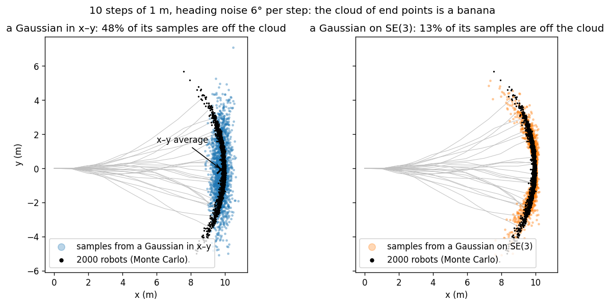
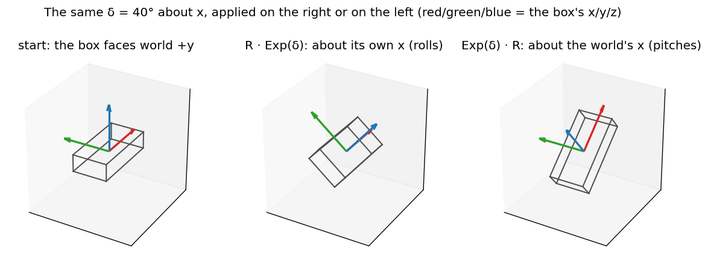
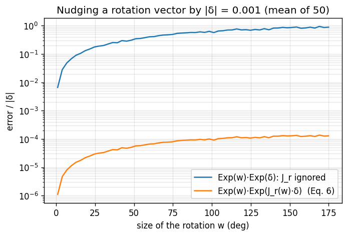

# A01 — Rotations and poses: SO(3), SE(3), Exp/Log, perturbations, Jacobians

For readers who know matrices and vectors and want the toolkit every later chapter uses: how to turn a
small rotation into a rotation matrix and back, which side to apply it on, and why a robot's position
uncertainty is shaped like a banana. No dataset needed.

> [!NOTE]
> **Book companion:** *SLAM in Autonomous Driving*, chapter 2
> ([English PDF](https://github.com/gaoxiang12/slam-in-ad-en/blob/main/sad-en.pdf)). Read the book for the
> full derivations; this chapter builds the tools in about 250 lines of Python.
>
> **Same code as DS-MSP.** `so3.py` and `se3.py` are copied verbatim from
> [DS-MSP](https://github.com/Munna-Manoj/DS-MSP) (`ds_msp/core/lie.py`), the same author's camera library,
> so the maths reads the same in both. `tools/check_lie.py` keeps the copies identical.



## What you will build

Three files, readable top to bottom, needing only NumPy, SciPy and Matplotlib:

| File | What it does |
|---|---|
| [`so3.py`](so3.py) | Rotations: `hat` (Eq. 1), `so3_exp` (Eq. 2), `so3_log` (Eq. 3), the right Jacobian (Eq. 6) |
| [`se3.py`](se3.py) | Poses: `se3_exp` (Eq. 7), `se3_adjoint` (Eq. 8), driving with noise (Eq. 9) and predicting the spread (Eq. 10) |
| [`main.py`](main.py) | The three scenes: a box turned on two sides, the Jacobian check, the banana |

```bash
cd course/chapters/A01-rotations-and-poses
python main.py          # about 10 s
```

## Intuition

> [!TIP]
> Rotations don't add like vectors: turning 90° left then 90° forward is not the same as the other way
> round. So a rotation is stored as a matrix, and changed by **multiplying** it with a small rotation, built
> from a 3-vector by the exponential map.

Multiplying raises a question vectors never ask: on which side? On the right, the small turn is about the
body's own axes (what a gyro measures). On the left, it is about the world's axes. Same numbers,
different result.

The same non-additivity bends uncertainty. A robot unsure of its heading by a few degrees, driving 10 m,
could end anywhere on an arc, not an ellipse. A Gaussian written on the pose itself (SE(3)) bends with the
arc; a Gaussian on x and y cannot.

## The math

A rotation vector $`w`$ (axis × angle, rad) is written as the skew-symmetric matrix of the cross product:

```math
[w]_\times = \begin{bmatrix} 0 & -w_3 & w_2 \\ w_3 & 0 & -w_1 \\ -w_2 & w_1 & 0 \end{bmatrix}, \quad [w]_\times v = w \times v \qquad (1)
```

The exponential map turns it into a rotation matrix (Rodrigues' formula), with $`\theta = \lVert w \rVert`$:

```math
\mathrm{Exp}(w) = I + \frac{\sin\theta}{\theta}[w]_\times + \frac{1-\cos\theta}{\theta^2}[w]_\times^2 \qquad (2)
```

The logarithm goes back. `so3_log` also handles $`\theta \approx 0`$ and $`\theta \approx \pi`$, where this
formula divides by zero:

```math
\theta = \arccos\frac{\mathrm{tr}(R) - 1}{2}, \quad w = \frac{\theta}{2\sin\theta}\,(R - R^\top)^\vee \qquad (3)
```

A small rotation $`\delta`$ can be applied on either side of $`R`$ (body to world):

```math
R \leftarrow R\,\mathrm{Exp}(\delta) \;\;\text{(right: body axes)}, \qquad R \leftarrow \mathrm{Exp}(\delta)\,R \;\;\text{(left: world axes)} \qquad (4)
```

> This course uses the **right** form by default: an IMU measures in the body frame, and both systems
> studied here (SE(3)-LVIO and lightning-lm) correct their state on the right. The two forms are related
> exactly, by rotating the vector:

```math
R\,\mathrm{Exp}(\delta) = \mathrm{Exp}(R\,\delta)\,R \qquad (5)
```

Nudging the rotation vector itself is not the same as multiplying by a nudge. The right Jacobian
$`J_r`$ converts one into the other:

```math
\mathrm{Exp}(w + \delta) \approx \mathrm{Exp}(w)\,\mathrm{Exp}(J_r(w)\,\delta), \quad J_r(w) = I - \frac{1-\cos\theta}{\theta^2}[w]_\times + \frac{\theta - \sin\theta}{\theta^3}[w]_\times^2 \qquad (6)
```

A pose $`T = \begin{bmatrix} R & t \\ 0 & 1 \end{bmatrix}`$ maps body points to world points. Its tangent
vector is $`\xi = [\rho, \phi]`$, translation part first (the DS-MSP order). Its exponential couples them
through the left Jacobian $`J_l(\phi) = J_r(\phi)^\top`$:

```math
\mathrm{Exp}(\xi) = \begin{bmatrix} \mathrm{Exp}(\phi) & J_l(\phi)\,\rho \\ 0 & 1 \end{bmatrix} \qquad (7)
```

The adjoint is Eq. 5 for poses: it moves a perturbation from one side of $`T`$ to the other.

```math
T\,\mathrm{Exp}(\xi) = \mathrm{Exp}(\mathrm{Ad}_T\,\xi)\,T, \quad \mathrm{Ad}_T = \begin{bmatrix} R & [t]_\times R \\ 0 & R \end{bmatrix} \qquad (8)
```

The banana robot drives $`N`$ steps $`u`$ (1 m forward). After each step it lands slightly off, by noise
$`w_k \sim \mathcal{N}(0, Q)`$ in its own frame:

```math
T_{k+1} = T_k\,\mathrm{Exp}(u)\,\mathrm{Exp}(w_k) \qquad (9)
```

Write the true pose as the noise-free pose $`\bar T_k`$ times an error, $`T_k = \bar T_k\,\mathrm{Exp}(\xi_k)`$.
Eq. 8 moves the old error past the step $`U = \mathrm{Exp}(u)`$, so to first order its covariance grows as:

```math
\Sigma_{k+1} = \mathrm{Ad}_{U^{-1}}\,\Sigma_k\,\mathrm{Ad}_{U^{-1}}^\top + Q \qquad (10)
```

> Eq. 10 needs no random numbers. $`\mathrm{Ad}_{U^{-1}}`$ has the block $`-[t]_\times`$: a heading error
> now becomes a sideways position error after the next metre. That block is what bends the cloud.

## Build it

Open the files in this order; each block is commented with the equation it implements.

1. **[`so3.py`](so3.py), `hat` and `so3_exp`.** Eq. 1 and 2. The small-angle branch is the Taylor series
   of Eq. 2, so nothing divides by zero.
2. **`so3_log`.** Eq. 3, plus the branch near 180° where $`\sin\theta \to 0`$: the axis comes from
   $`(R + I)/2 \approx a a^\top`$ instead.
3. **`so3_right_jacobian`.** Eq. 6, again with a Taylor branch.
4. **[`se3.py`](se3.py), `se3_exp` and `se3_adjoint`.** Eq. 7 and 8, built from the `so3.py` functions.
5. **`drive` and `propagate_covariance`.** Eq. 9 drives one noisy robot. Eq. 10 predicts the spread of all
   of them.
6. **[`main.py`](main.py).** Three scenes. The box applies one 40° turn on each side of Eq. 4. The Jacobian
   scene nudges rotation vectors of growing size. The banana drives 2000 robots, then compares two ways of
   describing where they ended up:
   - a Gaussian fitted to their x–y positions;
   - the SE(3) Gaussian of Eq. 10, mapped through Eq. 7.

   It samples both, and counts how many samples land "off the cloud": farther from every robot than 99%
   of the robots are from their nearest neighbour.

Output (`results/output.txt`):

```text
box: R·Exp(δ) and Exp(δ)·R end 56.0° apart; Eq. 5 holds to 1.3e-15
J_r: error/|δ| at 60° is 0.405 without J_r, 0.00007 with it; at 170° 0.91 without
banana (2000 runs, 10 x 1 m, 6°/step heading noise):
  x-y average is 3.6 cm from the nearest robot
  samples off the cloud: Gaussian in x-y 47.5%, Gaussian on SE(3) 12.6%
  Monte Carlo / predicted covariance (Eq. 10): total 1.01, lateral 1.00, along-track 26.5
break it, 10°/step: off the cloud x-y 51.3%, SE(3) 19.6%
```

## See it



*The box faces world +y. On the right (body axes), the turn is about the box's own red x axis, so it rolls.
On the left (world axes), the same numbers turn it about the world's x axis, so it pitches. The two results
are 56.0° apart, yet Eq. 5 converts one into the other to 1.3e-15.*



*Nudge a rotation vector $`w`$ by $`|\delta| = 0.001`$. Pretending the nudge multiplies on the right
unchanged is wrong by 0.405 |δ| at 60° and 0.91 |δ| at 170°, comparable to the nudge itself. With $`J_r`$ the
error is 0.00007 |δ| at 60°: what is left is second order.*

*The banana (top of the page): every robot's heading wanders by about 6° per metre, so the ends spread
along an arc of radius about 10 m. The x–y Gaussian (left) is an ellipse that ignores the bend: 47.5% of its
samples land where no robot ended up, and its centre sits inside the bend, 3.6 cm from the nearest robot.
The SE(3) Gaussian (right) is computed without a single sample (Eq. 10), and bends with the cloud: 12.6% off.*

## Break it

- **Raise the heading noise to 10° per step.** The x–y Gaussian is off for 51.3% of its samples; the SE(3)
  one for 19.6%. The SE(3) model is better, but Eq. 10 is first order: as the uncertainty grows, the terms
  it drops grow too.
- **The dropped terms are visible already at 6°.** Eq. 10 predicts the total spread and the sideways spread
  exactly (ratios 1.01 and 1.00). Along the track, though, the real spread is 26.5 times the prediction:
  Eq. 10 predicts only the 1 cm per step of forward noise, but forward error also comes from products of
  two errors (a heading error times a sideways error), which a first-order model drops. Higher-order
  propagation keeps them (Barfoot & Furgale, see below).
- **Skip $`J_r`$**, and every update that nudges a rotation vector is off by up to the size of the nudge
  (the Jacobian figure). An optimiser converges slowly or not at all; this is why DS-MSP's solver re-bases
  the rotation after every step, keeping $`w`$ small.

> [!IMPORTANT]
> Use the right perturbation $`R\,\mathrm{Exp}(\delta)`$ for state corrections, and Eq. 5 or Eq. 8 to switch
> sides. Represent pose uncertainty on SE(3) when the heading uncertainty is large, as after a long
> stretch without corrections. When a LiDAR update corrects the pose every 0.1 s, the uncertainty stays small
> and both models agree; whether SE(3) then helps is EXP-009's question.

## Run it in C++

The book's `motion` drives a car in a circle by integrating a constant angular velocity on the right,
`pose.so3() = pose.so3() * SO3::exp(omega * dt)` (`src/ch2/motion.cc`): Eq. 4, right form. After building SAD
([its README](https://github.com/gaoxiang12/slam_in_autonomous_driving#readme)), from the SAD folder:

```bash
./bin/motion --angular_velocity=10 --linear_velocity=5     # opens a 3D window; runs until you close it
```

Try `--use_quaternion=true`: the same motion with a quaternion update, the other common way to store a
rotation. SAD's types come from [Sophus](https://github.com/strasdat/Sophus) (`src/common/eigen_types.h`).
The same operations there:

| Here (DS-MSP names) | Sophus |
|---|---|
| `so3_exp(w)` / `so3_log(R)` | `SO3d::exp(w)` / `R.log()` |
| `se3_exp(xi)` / `se3_log(T)` | `SE3d::exp(xi)` / `T.log()` |
| `se3_adjoint(T)` | `T.Adj()` |
| `hat(w)` | `SO3d::hat(w)` |

> [!WARNING]
> Sophus orders the tangent the same way, translation first: `SE3d::exp` takes $`[\rho, \phi]`$. GTSAM's
> `Pose3` puts rotation first. Always check the order before copying a covariance between libraries.

## In the real systems

| Concept here | SE(3)-LVIO | lightning-lm |
|---|---|---|
| Pose correction | `core/lie.cpp` `boxplus`: `pose * SE3d::exp(delta)`, the SE(3) retraction | `src/common/nav_state.h` `NavState::boxplus`: `rot_ * SO3::exp(dx)`, translation added (SO(3)×R³) |
| Which side | right | right |
| Uncertainty of the pose | SE(3) error state: the "banana" model | rotation and position errors as separate vectors: the "x–y" model, with full cross-covariance |

The explanation page [SE(3) vs SO(3)×R³](../../../docs/explain/se3-vs-so3xr3.md) explains why both still
estimate rotation and translation jointly. Read the code after this chapter; the names should now look familiar.
(Code is linked, never copied: lightning-lm has no licence.)

## Experiment hooks

- [EXP-009](../../../docs/experiments/EXP-009-se3-vs-so3xr3.md): SE(3) vs SO(3)×R³ retraction in the IEKF. Does the banana matter when LiDAR corrects every 0.1 s?

## Try it

1. Set the roll and pitch noise in `SIGMA` to zero. Does the banana change? Predict before running.
   <details><summary>Answer</summary>Hardly. The top view bends because of heading (yaw) noise; roll and
   pitch errors move the robot up and down, which the top view doesn't show.</details>
2. In `scene_box`, apply the left perturbation with $`R\,\delta`$ instead of $`\delta`$. What happens?
   <details><summary>Answer</summary>The result equals the right perturbation exactly: this is Eq. 5. The
   left form needs the vector expressed in world axes.</details>
3. Drive 20 steps of 0.5 m instead of 10 of 1 m, with the same noise per step. More or less banana?
   <details><summary>Answer</summary>More. Each heading error now has a shorter lever arm (the
   $`[t]_\times`$ block of Eq. 8), but there are twice as many of them, and the noise is per step: the
   heading variance doubles. Noise that is specified per step depends on the step size; that is why IMU
   noise is given per $`\sqrt{\text{Hz}}`$ (B01, Eq. 8).</details>

## References

- T. D. Barfoot, P. T. Furgale, "Associating Uncertainty With Three-Dimensional Poses for Use in Estimation
  Problems", *IEEE T-RO* 2014: Eq. 10 and its higher-order versions.
- A. W. Long, K. C. Wolfe, M. J. Mashner, G. S. Chirikjian, "The Banana Distribution is Gaussian: A
  Localization Study with Exponential Coordinates", *RSS* 2012: the banana scene.
- J. Solà, J. Deray, D. Atchuthan, "A micro Lie theory for state estimation in robotics", 2018: right and left
  perturbations, Jacobians.

## Next

A02 (Kalman filters) uses `so3_exp` and the right perturbation to build the error-state Kalman filter.
B01 (IMU propagation) integrates gyro readings with Eq. 2. See the
[course map](../../../docs/learn/README.md).
