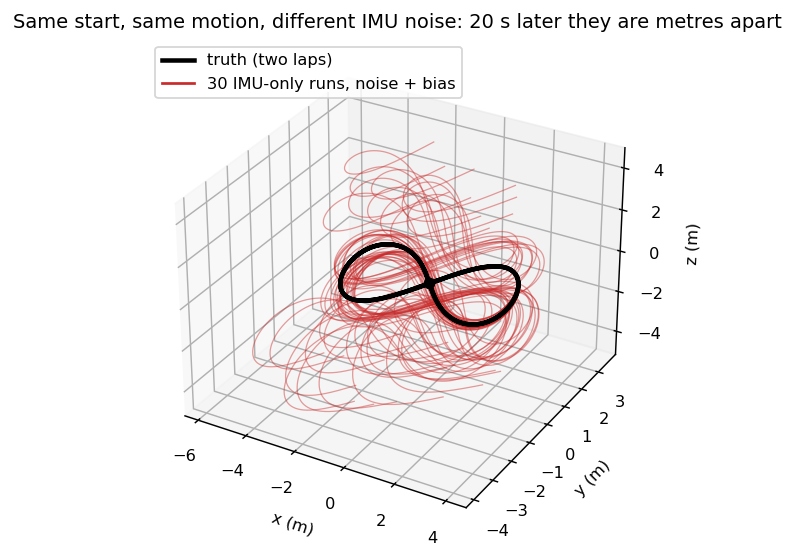
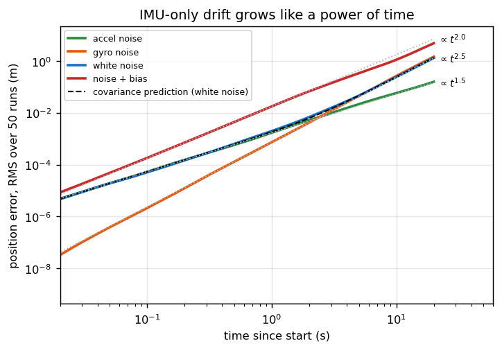
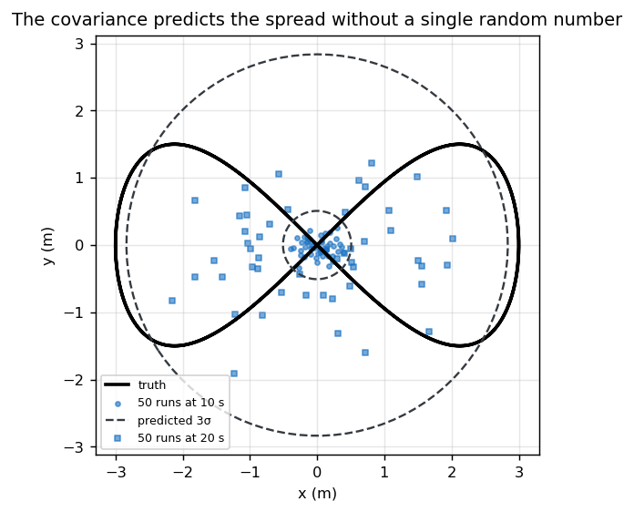

# B01 — IMU propagation: why IMU-only odometry drifts, and how fast

For readers who know basic rotations (A01) and want to see, with numbers, why every LiDAR-inertial
system needs something besides the IMU. No dataset needed.

> [!NOTE]
> **Book companion:** *SLAM in Autonomous Driving*, chapter 3
> ([English PDF](https://github.com/gaoxiang12/slam-in-ad-en/blob/main/sad-en.pdf)) · code
> [`src/ch3`](https://github.com/gaoxiang12/slam_in_autonomous_driving/tree/master/src/ch3). Read the book
> for the full derivation; this chapter builds the idea from scratch in about 200 lines of Python.



## What you will build

Three files, readable top to bottom, needing only NumPy and Matplotlib:

| File | What it does |
|---|---|
| [`simulate.py`](simulate.py) | A 20 s figure-eight you could draw by hand, and the gyro + accelerometer readings it produces (Eq. 6–8) |
| [`propagate.py`](propagate.py) | Dead reckoning: readings → rotation, velocity, position (Eq. 1–4), and the covariance that predicts the error (Eq. 5) |
| [`main.py`](main.py) | Runs 50 noisy IMUs per case, prints the table below, draws the figures |

```bash
cd course/chapters/B01-imu-propagation
python main.py          # about 30 s
```

## Intuition

> [!TIP]
> An IMU measures **change**: rotation rate and acceleration. Position comes from integrating twice.
> Every small error is integrated twice too, so it never shrinks, and it grows faster the longer you wait.

There is a less obvious effect that dominates real drift. The accelerometer measures gravity as well as
motion. To get motion, the integrator subtracts gravity, using its current guess of the tilt. If gyro
noise has tilted that guess by 0.1°, a sliver of gravity (9.81 m/s² × 0.0017) leaks in as a fake
acceleration, forever. This is why gyro quality decides IMU drift more than accelerometer quality.

## The math

The integrator steps the state from sample $k$ to $k+1$. $\Delta t$ is the IMU period (5 ms here).

$$R_{k+1} = R_k\,\mathrm{Exp}(\omega_k\,\Delta t) \tag{1}$$

> $R_k$ is the body-to-world rotation, $\omega_k$ the measured angular rate (rad/s, body frame).
> $\mathrm{Exp}$ turns a rotation vector into a rotation matrix (Rodrigues' formula, `so3_exp`).

$$a_k = R_k\,f_k + g \tag{2}$$

> $f_k$ is the accelerometer's specific force (m/s², body frame); $g = (0, 0, -9.81)$ is gravity in the
> world frame. This is the gravity-removal step. It uses the *estimated* $R_k$, so a tilt error becomes
> an acceleration error.

$$v_{k+1} = v_k + a_k\,\Delta t \tag{3}$$

$$p_{k+1} = p_k + v_k\,\Delta t + \tfrac12 a_k\,\Delta t^2 \tag{4}$$

To predict the error without simulating it, propagate the covariance $P$ of the 9-dim error
$[\delta\theta,\ \delta v,\ \delta p]$:

$$P_{k+1} = F_k\,P_k\,F_k^\top + G_k\,Q\,G_k^\top \tag{5}$$

> $F_k$ says how an error at step $k$ becomes one at $k+1$. Its block $-R_k\,[f_k]_\times\,\Delta t$ is the
> gravity leak: a tilt error $\delta\theta$ produces a velocity error. $G_k$ says how one sample's noise
> enters the state. $Q$ holds the per-sample noise variances (Eq. 8).

The simulator runs the same physics backwards. From the true motion it computes what a perfect IMU would
read, then adds the sensor's errors:

$$\omega_k = \mathrm{Log}(R_k^\top R_{k+1}) / \Delta t \tag{6}$$

$$f_k = R_k^\top (a_k - g) \tag{7}$$

$$\sigma_{\text{per sample}} = \sigma_{\text{density}} / \sqrt{\Delta t} \tag{8}$$

> Eq. 8 is why IMU data sheets quote noise *densities* (per $\sqrt{\text{Hz}}$): the faster you sample,
> the noisier each sample, and the result is the same accumulated error.

How fast each error source grows follows from how many times it is integrated:

| Error source | Integrated | Position error grows like |
|---|---|---|
| Accelerometer white noise | velocity random walk, then once more | $t^{1.5}$ |
| Gyro white noise | angle random walk → gravity leak → twice more | $t^{2.5}$ |
| Constant accelerometer bias | twice | $t^{2}$ |

## Build it

Open the files in this order; each block is commented with the equation it implements.

1. **[`simulate.py`](simulate.py), `figure_eight`.** The truth is a formula of time, so it is exact. The
   body faces where it goes and rocks a little, so all three gyro axes are exercised.
2. **`imu_readings` and `add_imu_errors`.** Eq. 6–7 give a perfect IMU; then white noise (Eq. 8) and
   a constant bias are added. Keeping the two apart lets `main.py` reuse the perfect readings.
3. **[`propagate.py`](propagate.py), `propagate`.** The four lines inside the loop are Eq. 1–4.
4. **`propagate_covariance`.** Eq. 5, with $F_k$ and $G_k$ written block by block.
5. **[`main.py`](main.py).** It integrates the perfect readings first. Every noisy run is then measured
   against that perfect-IMU path, so the table shows what the *sensor* costs, separate from the
   integrator's own step error.

Output (`results/output.txt`):

```text
trajectory: 4001 samples, dt = 5.0 ms, path length 37.5 m
              |      0.1 s         1 s         5 s        10 s        20 s
  accel noise |   0.0001 m    0.0017 m    0.0215 m    0.0578 m    0.1573 m
   gyro noise |   0.0000 m    0.0007 m    0.0443 m    0.2649 m    1.4702 m
  white noise |   0.0001 m    0.0020 m    0.0459 m    0.2401 m    1.3126 m
 noise + bias |   0.0002 m    0.0177 m    0.3382 m    1.1186 m    4.8415 m
perfect IMU: largest step error over 20 s = 1.08 cm
gyro noise overtakes accel noise after 2.4 s
at 20 s: Monte Carlo 1.3126 m, covariance predicts 1.3404 m (ratio 0.98)
```

## See it



*On log-log axes a power law is a straight line, so read the slopes, not the heights. Accelerometer
noise follows $t^{1.5}$. Gyro noise starts far lower but follows $t^{2.5}$, overtakes the accelerometer
after 2.4 s, and by 20 s it is nearly the whole white-noise error. The dashed covariance
prediction sits on the Monte Carlo curve.*



*Both laps end where they started, at the origin. The dots are where 50 noisy IMUs think they are after
one lap (10 s) and after two laps (20 s). The dashed circles are the 3σ ellipses from Eq. 5, computed
without a single random number. The filter "knows" how wrong it is (ratio 0.98 at 20 s).*

## Break it

- **Add small biases**, 0.02 m/s² and 0.001 rad/s. The 20 s error grows from 1.3126 m to 4.8415 m.
  That's why real filters put the biases in the state (B02 and
  [EXP-010](../../../docs/experiments/EXP-010-state-17-vs-12.md)).
- **A perfect IMU is not error-free.** The simple Euler step alone is off by up to 1.08 cm along the
  way. It doesn't grow, but it sets a floor that better integration (midpoint, or preintegration in B03)
  lowers.

> [!IMPORTANT]
> Within seconds, IMU-only position is useless at the centimetre level. Its job in an LIO system is to
> bridge the 100 ms between LiDAR scans, and there it is excellent: at 0.1 s every row of the table is
> at most 0.0002 m, even with biases. That short-horizon accuracy is what makes the IMU a good
> *prior* for the LiDAR update.

## Run it in C++

The book's `run_imu_integration` integrates a real vehicle IMU log (`data/ch3/10.txt`, shipped with the
SAD code) with the same three update lines. After building SAD
([its README](https://github.com/gaoxiang12/slam_in_autonomous_driving#readme)), from the SAD folder:

```bash
./bin/run_imu_integration --with_ui=false
python3 scripts/plot_ch3_state.py data/ch3/state.txt
```

Compare SAD's `src/ch3/imu_integration.h` with [`propagate.py`](propagate.py): the same three lines
(rotation, velocity, position). The C++ version has no covariance yet; that arrives with the ESKF in B02.

## In the real systems

| Concept here | SE(3)-LVIO | lightning-lm |
|---|---|---|
| Mean propagation | `core/state_predict.cpp`; propagates on SE(3) with the velocity in the body frame | `LaserMapping::ProcessIMU` → ESKF predict, SO(3)×R³ |
| Covariance propagation | 17-dim error state (adds biases and S2 gravity) | 12-dim error state (gyro bias; accel bias and gravity fixed) |
| Per-point use | propagates *backwards* inside the scan to deskew each point, with per-point covariance | forward IMU undistortion |

Read these files after this chapter; the structure should now look familiar. (Code is linked, never
copied: lightning-lm has no licence.)

## Experiment hooks

- [EXP-010](../../../docs/experiments/EXP-010-state-17-vs-12.md): estimating the accelerometer bias and gravity online. Does it pay off?
- [EXP-011](../../../docs/experiments/EXP-011-online-time-offset-lever-arm.md): an IMU time offset is a rotation error in disguise.
- [EXP-018](../../../docs/experiments/EXP-018-stress-suite.md): a 5 ms IMU time shift as a stress profile.

## Try it

1. Halve `GYRO_NOISE` in `main.py`. Predict the 20 s "white noise" error before running.
   <details><summary>Answer</summary>A little more than half. Gyro noise dominates and scales linearly
   with the density, but the accelerometer's 0.1573 m is now a visible share of what is left.</details>
2. Call `figure_eight(rate=100.0)`. Which line of the output changes most, and why?
   <details><summary>Answer</summary>The perfect-IMU step error: Euler's error grows with $\Delta t$.
   The noise rows barely move, because a noise <em>density</em> is independent of the sampling rate
   (Eq. 8).</details>

## Next

B02 (ESKF with GNSS) puts the biases into the state and corrects the drift with GNSS. Then
B03 (IMU preintegration) summarises hundreds of IMU samples into one relative-motion measurement, so an
optimiser can reuse them cheaply. See the [course map](../../../docs/learn/README.md).
