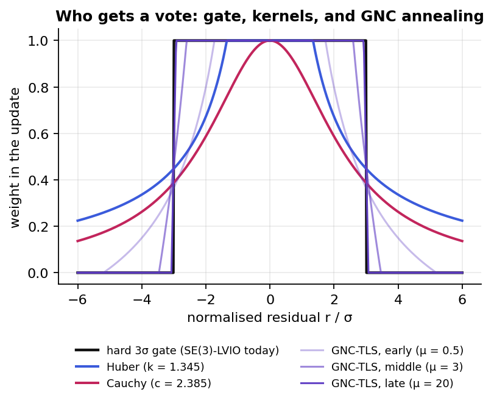

# Outliers in an iterated Kalman filter: gate, kernel or GNC?

This page explains how SE(3)-LVIO handles bad LiDAR matches today, and why it uses a hard gate instead
of graduated non-convexity (GNC). It also covers what robust kernels and GNC would change.
Experiments [EXP-001](../experiments/EXP-001-chi2-gate-sweep.md),
[EXP-002](../experiments/EXP-002-robust-kernels-iekf.md) and
[EXP-003](../experiments/EXP-003-gnc-tls-iekf.md) measure it.

## The update is a small weighted least-squares problem

Each IEKF iteration solves for the correction $\delta x$ that best explains every point-to-plane
residual, while staying close to the IMU prediction:

$$\delta x^\star = \arg\min_{\delta x}\ \|\delta x\|^2_{P^{-1}} + \sum_i w_i\,\frac{r_i(\delta x)^2}{\sigma_i^2}$$

> $P$ is the predicted covariance (the IMU prior), $r_i$ the distance of point $i$ to its plane (m),
> $\sigma_i^2$ its variance from point and plane uncertainty, and $w_i$ the weight that decides how much
> the point is allowed to pull.

The whole outlier question is: **how is $w_i$ chosen?**

## What SE(3)-LVIO does today: three cheap filters

1. **Plane association.** A point is matched only to a voxel whose points pass a planarity test.
2. **A hard 3σ gate.** $w_i = 1$ if $|r_i| \le 3\sigma_i$, otherwise $0$.
3. **Uncertainty weighting.** The weight is $1/\sigma_i^2$, combining point and plane covariance.

This is a truncated least-squares (TLS) cost with a **fixed** truncation, applied in one shot.

*The black step is today's gate. Huber and Cauchy fade weights smoothly instead of cutting. GNC-TLS
starts wide (early) and sharpens toward the gate (late) over its iterations.*

## Why not GNC?

> [!TIP]
> GNC is built for problems where **most** measurements may be wrong and you have **no good starting
> guess**: global registration, loop closures. A LIO update has neither problem.

| Factor | LIO update | Where GNC shines |
|---|---|---|
| Starting guess | IMU prediction, mm–cm away | unknown (global registration) |
| Outlier rate after association | low | up to 90 %+ |
| Iterations available | 4–5 per scan | 10–50 reweighted solves |
| Budget | ~30 ms per scan | offline or occasional |

With a good prior, wrong matches already have large residuals at the first iteration, so a fixed gate
catches them. GNC's slow widening-then-sharpening adds compute, and little else.

## Where GNC would earn its cost

- **Loop closures in the backend.** One false loop can bend the whole pose graph.
  `gtsam::GncOptimizer` exists for exactly this. Tested in [EXP-015](../experiments/EXP-015-gnc-pgo-false-loops.md).
- **Dense dynamic clutter** (crowds, heavy smoke), where outliers stop being rare. The stress suite
  ([EXP-018](../experiments/EXP-018-stress-suite.md)) creates that condition on purpose.

## The cheap experiment inside the IEKF

The filter already rebuilds every residual at each iteration. So annealing GNC-TLS weights over
those 4–6 iterations costs almost nothing extra, which is EXP-003. The prediction, written before
any data: within noise on clean missions, better only under heavy clutter.

**Try it:** look at the figure and predict which kernel keeps the most information from a residual at
2.5σ. Then check EXP-002's inlier counts.
