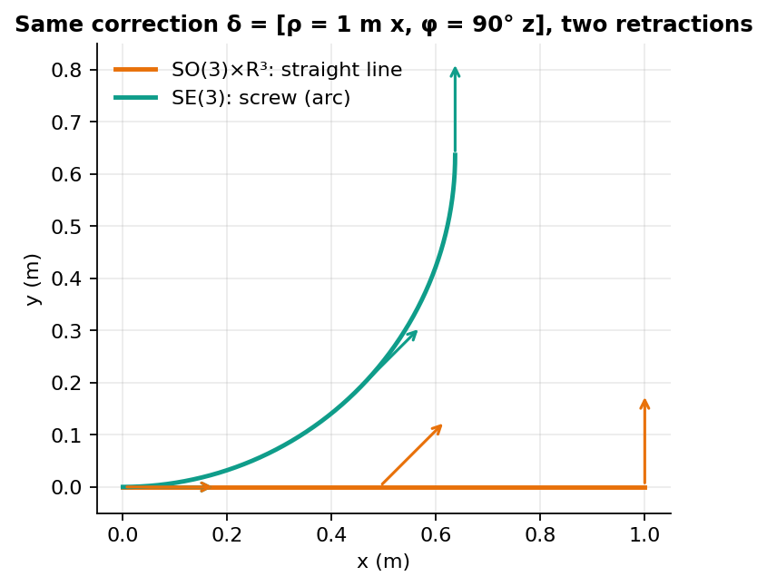
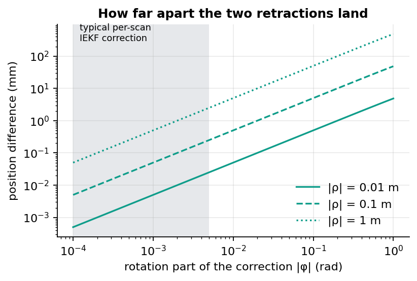

# SE(3) vs SO(3)×R³: does the coupled retraction matter?

This page explains what changes, and what doesn't, when a filter applies its pose correction on SE(3)
instead of on SO(3)×R³. Experiment [EXP-009](../experiments/EXP-009-se3-vs-so3xr3.md) measures it.

## Both estimate rotation and translation jointly

A common belief: "only SE(3) optimises rotation and translation together." It isn't true for these filters.

In FAST-LIO-style filters the state is one vector (rotation, position, velocity, biases, gravity)
with one full covariance matrix:
- **The off-diagonal blocks link rotation and position.** The IMU model fills them:

$$v_{k+1} = v_k + (R_k\,a_k + g)\,\Delta t$$

$$p_{k+1} = p_k + v_k\,\Delta t$$

> $R_k$ is the body-to-world rotation, $a_k$ the bias-corrected acceleration (m/s²), $g$ gravity, $v_k$
> and $p_k$ the world-frame velocity and position, $\Delta t$ the IMU period (s). A rotation error tilts
> $R_k a_k$, which becomes velocity error, then position error.

- **One residual corrects everything.** The Kalman gain uses those blocks, so a single point-to-plane
  residual corrects rotation and translation together.

> [!IMPORTANT]
> Joint estimation comes from the covariance and the Jacobians, not from the choice of group.

## What SE(3) actually changes: the retraction

The filter computes a small correction $\delta = [\rho;\ \phi]$ and must apply it to the pose. The two
choices differ only in how translation is applied:

$$\text{SO(3)×R³:}\quad R \leftarrow R\,\mathrm{Exp}(\phi), \qquad p \leftarrow p + \rho$$

$$\text{SE(3):}\quad R \leftarrow R\,\mathrm{Exp}(\phi), \qquad p \leftarrow p + R\,J_l(\phi)\,\rho$$

> $\phi$ is the rotation part of the correction (rad), $\rho$ the translation part (m), and $J_l(\phi)$
> the left Jacobian of SO(3). On SE(3) the translation follows a screw motion that turns while it moves.

*A deliberately huge correction (1 m, 90°) to make the shapes visible. The SE(3) path bends with the
rotation; the SO(3)×R³ path is a straight line. Same end orientation, different end position.*

## How big is the difference in practice?

To first order the two end positions differ by

$$\Delta p \approx \tfrac{1}{2}\,\phi \times \rho$$

> For a typical iterated-filter correction, $|\phi| \approx 10^{-3}$ rad and $|\rho| \approx 1$ cm, so
> $|\Delta p| \approx 5\,\mu$m.

*The shaded band is where per-scan corrections live. Inside it, the gap is micrometres to a fraction
of a millimetre. It reaches millimetres only with large rotation corrections.*

Large motions inside a scan (a fast turn) are handled by IMU integration, which both formulations do the
same way. The retraction only applies the small residual correction.

## Where SE(3) can still help

| Situation | Why SE(3) may help |
|---|---|
| Start-up with a poor heading | Large $\phi$: the first-order gap above grows |
| Long LiDAR-degenerate stretch | Rotation uncertainty grows; an SE(3)-Gaussian can represent the curved ("banana") position uncertainty |
| Consistency | A group-based error is less tied to the current estimate; full theory needs SE₂(3) (invariant EKF), which adds velocity |

> [!NOTE]
> SE(3) holds pose only. The IMU state also contains velocity, so the group that matches IMU motion
> is SE₂(3), the "extended pose" of the invariant EKF (Barrau & Bonnabel). SE(3) is in between.

## Why most systems still use SO(3)×R³

1. **The gains are small** with good sensors (see the band above).
2. **Simpler Jacobians and code:** the FAST-LIO family builds on IKFoM's product-manifold toolkit.
3. **Inherited code:** forks keep the state definition of their parent.

## What we test

[EXP-009](../experiments/EXP-009-se3-vs-so3xr3.md) runs the same SE(3)-LVIO build with only the
retraction swapped. The theory above predicts "within noise" on clean missions.

**Try it:** before reading the result, predict on which mission a difference would show up first, and why.
