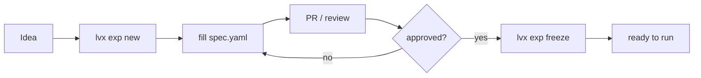

# Propose an experiment

Turn an idea into a pre-registered spec that is allowed to run.



## 1. Create it

```bash
lvx exp new chi2-gate-sweep --phase P1
# created experiments/EXP-020-chi2-gate-sweep/spec.yaml and docs/experiments/EXP-020-chi2-gate-sweep.md
```

## 2. Fill every TODO

Use the [spec rules](https://github.com/Munna-Manoj/LVIO_exp/blob/main/docs/process/EXPERIMENT_PROTOCOL.md#3-writing-a-good-spec):
- one question;
- a hypothesis with a mechanism;
- a prediction with direction and size;
- one change per variant;
- a decision rule that uses the noise floor.

```bash
python tools/check_experiments.py     # schema + references
lvx report EXP-020                    # the report shows the draft hypothesis table
```

## 3. Get approval, then freeze

```bash
lvx exp freeze EXP-020 --approved-by Munna-Manoj
# EXP-020 frozen (sha256 3f9c…), status approved
```

> [!IMPORTANT]
> After freezing, the hypothesis, variants, missions and decision rule cannot change. To change the
> plan, create a new experiment with `--supersedes EXP-020`.
