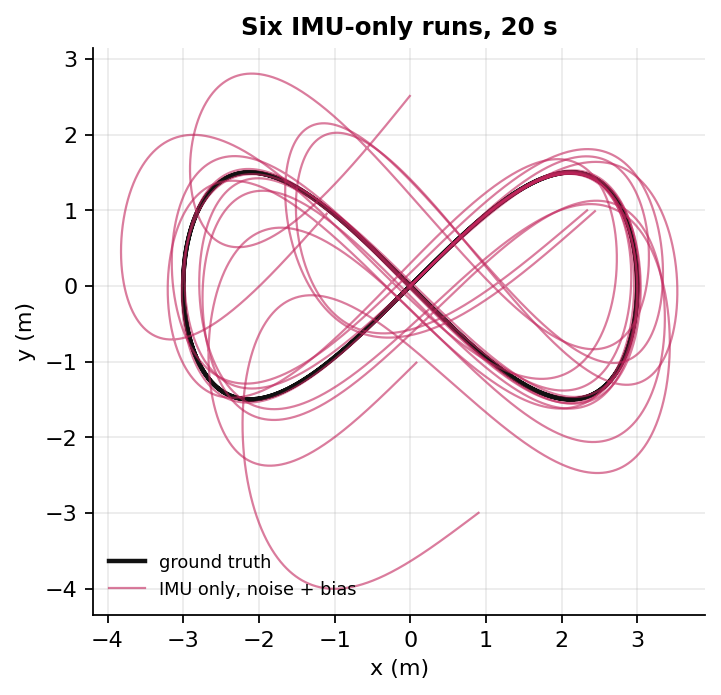

# B01 — IMU propagation: why IMU-only odometry drifts, and how fast

For readers who know basic rotations ([A01](README.md)) and want to see, with numbers, why every
LiDAR-inertial system needs something besides the IMU. Runs in about 4 s, no dataset needed.

<!-- course:begin book -->
> [!NOTE]
> **Book companion:** *SLAM in Autonomous Driving*, chapter 3 ([English PDF](https://github.com/gaoxiang12/slam-in-ad-en/blob/main/sad-en.pdf)) · code [`src/ch3`](https://github.com/gaoxiang12/slam_in_autonomous_driving/tree/master/src/ch3) · apps `run_imu_integration`. Read the book chapter for the full derivation; this page builds the idea from scratch and connects it to the study.
<!-- course:end book -->

## What you will build

- An IMU **simulator**: a 20 s figure-eight with turns and tilts, giving perfect and noisy gyro/accelerometer samples.
- An IMU **integrator** that turns those samples into rotation, velocity and position.
- An **error-state covariance** that predicts how wrong the integrator will be, checked against 200 Monte Carlo runs.

Everything lives in `course/lvio_course/` (`sim.py`, `imu.py`). Later chapters reuse it unchanged.

```bash
python course/chapters/B01-imu-propagation/run.py
```

## Intuition

> [!TIP]
> An IMU measures **change**: rotation rate and acceleration. Position comes from integrating twice. Every
> small error is integrated twice too, so it never shrinks, and it grows faster the longer you wait.

There is a less obvious effect that dominates real drift. The accelerometer measures gravity as well as
motion. To get motion, the integrator subtracts gravity, using its current guess of the tilt. If gyro noise
has tilted that guess by 0.1°, a sliver of gravity (9.81 m/s² × 0.0017) leaks in as fake acceleration,
forever. This is why gyro quality decides IMU drift more than accelerometer quality.

## The math

The integrator steps the state from sample $k$ to $k+1$, with $\Delta t$ the IMU period (5 ms here):

$$R_{k+1} = R_k\,\mathrm{Exp}(\omega_k\,\Delta t)$$

> $R_k$ is the body-to-world rotation and $\omega_k$ the measured angular rate (rad/s) in the body frame.
> $\mathrm{Exp}$ turns a rotation vector into a rotation matrix ([A01](README.md)).

$$a_k = R_k\,f_k + g$$

> $f_k$ is the accelerometer's specific force (m/s², body frame), and $g = (0, 0, -9.81)$ is gravity
> in the world frame. This is the gravity-removal step: it uses the *estimated* $R_k$, so a tilt error
> becomes an acceleration error.

$$v_{k+1} = v_k + a_k\,\Delta t, \qquad p_{k+1} = p_k + v_k\,\Delta t + \tfrac12 a_k\,\Delta t^2$$

To predict the error without simulating it, we propagate the covariance $P$ of the 9-dim error
$[\delta\theta,\ \delta v,\ \delta p]$:

$$P_{k+1} = F_k\,P_k\,F_k^\top + G_k\,Q\,G_k^\top$$

> $F_k$ says how today's error becomes tomorrow's. Its block $-R_k\,[f_k]_\times\,\Delta t$ is the
> gravity leak: a tilt error $\delta\theta$ produces a velocity error. $Q$ holds the per-sample noise
> variances (noise density² / $\Delta t$), and $G_k$ maps them into the state.

How fast each source grows follows from how many times it is integrated:

| Error source | Integrated | Position error grows like |
|---|---|---|
| Accelerometer white noise | velocity random walk, then once more | $t^{1.5}$ |
| Gyro white noise | angle random walk → gravity leak → twice more | $t^{2.5}$ |
| Constant accelerometer bias | twice | $t^{2}$ |

## Build it

**1. Simulate.** The truth is analytic. The IMU is derived from it, so every error you see comes from the integrator or the sensor, never the simulator.

<!-- snippet:begin run.py#simulate -->
```python
truth = sim.figure_eight(duration=20.0, rate=200.0)          # 20 s, 200 Hz, analytic ground truth
dt = truth.t[1] - truth.t[0]
clean = sim.ImuNoise(gyro_density=0.0, accel_density=0.0)     # a perfect IMU
noisy = sim.ImuNoise()                                        # MEMS-class white noise only
gyro_only = sim.ImuNoise(accel_density=0.0)                   # the same, split by sensor
accel_only = sim.ImuNoise(gyro_density=0.0)
biased = sim.ImuNoise(gyro_bias=0.001, accel_bias=0.02)       # + small constant biases
print(f"trajectory: {len(truth.t)} samples, dt = {dt * 1e3:.1f} ms, "
      f"path length {np.linalg.norm(np.diff(truth.p, axis=0), axis=1).sum():.1f} m")
```
<!-- snippet:end -->

**2. Propagate 200 noisy runs per case**, and measure each against the perfect-IMU path. That isolates
the sensor's contribution from the integrator's own discretisation error.

<!-- snippet:begin run.py#propagate -->
```python
runs = 200
results = {}
cases = {"perfect": clean, "accel noise": accel_only, "gyro noise": gyro_only,
         "white noise": noisy, "noise + bias": biased}
for name, noise in cases.items():
    gyro, accel = sim.imu_from_truth(truth, noise, seed=1, n_runs=1 if name == "perfect" else runs)
    R, v, p = imu.propagate(truth.R[0], truth.v[0], truth.p[0], gyro, accel, dt)
    if name == "perfect":
        p_perfect = p[0]                                      # same integrator, no sensor error
        err = np.linalg.norm(p - truth.p[None], axis=-1)      # discretisation error only
    else:
        err = np.linalg.norm(p - p_perfect[None], axis=-1)    # error caused by the sensor alone
    results[name] = np.sqrt((err**2).mean(axis=0))            # RMS over Monte Carlo runs
    row = "  ".join(f"{c:>4.0f} s: {results[name][int(c / dt)]:9.4f} m" for c in CHECKPOINTS)
    print(f"{name:>13} | {row}")
print(f"perfect IMU: largest error over 20 s = {results['perfect'].max() * 100:.2f} cm (discretisation only; "
      "noise rows are measured against this perfect-IMU path)")
```
<!-- snippet:end -->

**3. Predict the same error with the covariance**, without any random numbers.

<!-- snippet:begin run.py#covariance -->
```python
gyro1, accel1 = sim.imu_from_truth(truth, clean, n_runs=1)
P = imu.propagate_covariance(truth.R, gyro1[0], accel1[0], dt, noisy.gyro_density, noisy.accel_density)
sigma_pred = np.sqrt(np.trace(P[:, 6:9, 6:9], axis1=1, axis2=2))   # predicted position std (m)
ratio = results["white noise"][-1] / sigma_pred[-1]
print(f"at 20 s: Monte Carlo RMS {results['white noise'][-1]:.4f} m, "
      f"covariance predicts {sigma_pred[-1]:.4f} m  (ratio {ratio:.2f})")
```
<!-- snippet:end -->

Expected output:

<!-- output:begin results/run.txt -->
```text
trajectory: 4001 samples, dt = 5.0 ms, path length 37.5 m
      perfect |    1 s:    0.0038 m     5 s:    0.0099 m    10 s:    0.0001 m    20 s:    0.0002 m
  accel noise |    1 s:    0.0017 m     5 s:    0.0191 m    10 s:    0.0546 m    20 s:    0.1525 m
   gyro noise |    1 s:    0.0007 m     5 s:    0.0421 m    10 s:    0.2401 m    20 s:    1.3805 m
  white noise |    1 s:    0.0018 m     5 s:    0.0473 m    10 s:    0.2481 m    20 s:    1.3880 m
 noise + bias |    1 s:    0.0174 m     5 s:    0.3344 m    10 s:    1.1091 m    20 s:    4.7052 m
perfect IMU: largest error over 20 s = 1.08 cm (discretisation only; noise rows are measured against this perfect-IMU path)
at 20 s: Monte Carlo RMS 1.3880 m, covariance predicts 1.3404 m  (ratio 1.04)
```
<!-- output:end -->

## See it


*Read the slopes, not the heights. Accelerometer noise follows $t^{1.5}$; gyro noise starts far lower
but follows $t^{2.5}$. It overtakes the accelerometer after about 3 s, and by 20 s it is the whole story
(<!-- m:rms_position_error_m/gyro noise/20s|.2f -->1.38<!-- /m --> m of the
<!-- m:rms_position_error_m/white noise/20s|.2f -->1.39<!-- /m --> m). The dashed covariance prediction
sits on the Monte Carlo curve: the filter "knows" how wrong it is
(ratio <!-- m:mc_over_predicted_20s|.2f -->1.04<!-- /m -->).*



*Same IMU model with small biases. The first loop looks fine; the second has already wandered off by metres.*

## Break it

- **Add biases** of only 0.02 m/s² and 0.001 rad/s. The 20 s error grows from
  <!-- m:rms_position_error_m/white noise/20s|.2f -->1.39<!-- /m --> m to
  <!-- m:rms_position_error_m/noise + bias/20s|.2f -->4.71<!-- /m --> m. This is why real filters
  estimate biases in the state (chapter B02 and EXP-010).
- **A perfect IMU is not error-free.** The simple Euler step alone is off by up to
  <!-- m:perfect_imu_max_error_m|.3f -->0.011<!-- /m --> m along the way. It doesn't grow, but it sets
  a floor that better integration (midpoint, preintegration in B03) lowers.

> [!IMPORTANT]
> Within seconds, IMU-only position is useless at the centimetre level. Its job in an LIO system is to
> bridge the 100 ms between LiDAR scans, where it is excellent: the noise rows at 0.1 s are
> sub-millimetre. That short-horizon accuracy is what makes the IMU a good *prior* for the LiDAR update.

## Run it in C++

The book's `run_imu_integration` integrates a real IMU log (the built-in `data/ch3/10.txt`) with the
same equations as `imu.propagate`, on a real vehicle IMU instead of a simulated one. Plot its output with
the book's `scripts/plot_ch3_state.py` and compare the drift with the figure above.

<!-- course:begin labs -->
| Lab | App + arguments | Dataset | Last recorded run |
|---|---|---|---|
| `sad-ch3-imu-integration` | `run_imu_integration --with_ui=false` | sad-builtin | ok, 5 s, SAD `27f8e94`, 2026-10-07 |

```bash
lvx lab run sad-ch3-imu-integration
```
<!-- course:end labs -->

> [!TIP]
> Compare SAD's `src/ch3/imu_integration.h` with `course/lvio_course/imu.py`. The update has the same
> three lines (rotation, velocity, position). The C++ version simply has no covariance yet; that arrives
> with the ESKF in B02.

## In the real systems

| Concept here | SE(3)-LVIO | lightning-lm |
|---|---|---|
| Mean propagation | `core/state_predict.cpp`; propagates on SE(3) with the velocity in the body frame | `LaserMapping::ProcessIMU` → ESKF predict, SO(3)×R³ |
| Covariance propagation | 17-dim error state (adds biases and S2 gravity) | 12-dim error state (gyro bias; accel bias and gravity fixed) |
| Per-point use | propagates *backwards* inside the scan to deskew each point, with per-point covariance | forward IMU undistortion |

Read these files after this chapter; the structure should now look familiar. (Code is linked, never copied.
lightning-lm has no licence.)

## Experiment hooks

- [EXP-010](../experiments/EXP-010-state-17-vs-12.md): estimating the accelerometer bias and gravity online. Does it pay off?
- [EXP-011](../experiments/EXP-011-online-time-offset-lever-arm.md): an IMU time offset is a rotation error in disguise.
- [EXP-018](../experiments/EXP-018-stress-suite.md): a 5 ms IMU time shift as a stress profile.

## Try it

1. Halve `gyro_density` in `sim.ImuNoise`. Predict the 20 s "white noise" error before running.
   <details><summary>Answer</summary>About half. Gyro noise dominates and scales linearly with the
   density; the accelerometer's 0.15 m is now a visible share of it.</details>
2. Set `rate=100.0` in `figure_eight`. Which row changes most, and why?
   <details><summary>Answer</summary>"perfect": the Euler discretisation error grows with
   $\Delta t$. The noise rows barely move, because the noise *density* is per √Hz, independent of the
   sampling rate.</details>

## Next

[B02 — ESKF with GNSS](README.md), then [B03 — IMU preintegration](README.md): summarise hundreds of IMU samples into one relative-motion
measurement, with bias Jacobians, so an optimiser can re-use them cheaply.
