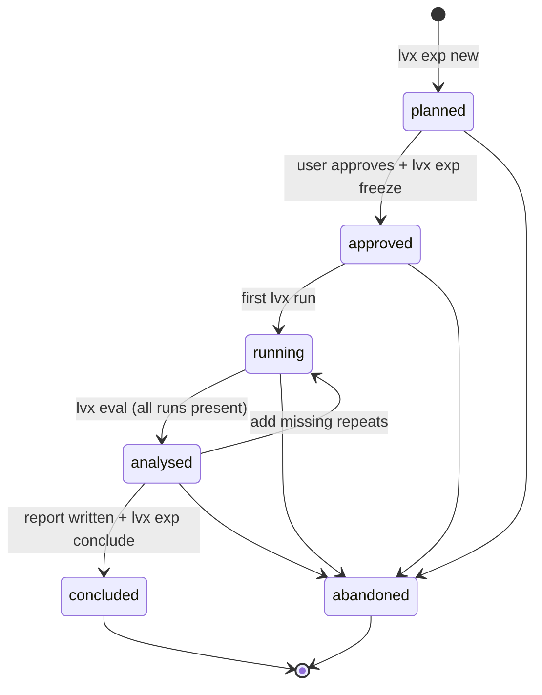
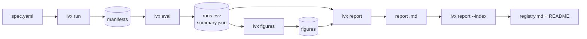

# Experiment protocol

How an idea becomes a trustworthy result here. This page is the long form of CLAUDE.md §2–§5.
It applies to people and to AI assistants alike.

## 1. Vocabulary and IDs

| Term | Meaning | ID / location |
|---|---|---|
| Experiment | One question, answered by comparing variants against a baseline | `EXP-NNN-<slug>`, `experiments/` |
| Baseline | A frozen system configuration | `configs/baselines/<name>.yaml` |
| Variant | The baseline plus **exactly one** change | `variants[].id` in the spec |
| Mission | One GrandTour recording | `configs/missions.yaml` |
| Run | One (variant, mission, repeat) execution | `<variant>__<mission>__r<k>` |
| Manifest | Provenance of one run | `results/manifests/<run>.json` |
| Noise floor | Run-to-run std of ATE per baseline and mission | EXP-000 `summary.json` |
| Milestone | A block of infrastructure work | `M<n>.<k>` in ROADMAP.md |

The baseline is always re-run inside each experiment, as variant `baseline`. Comparisons are paired:
same commit, same host, same day.

## 2. Lifecycle

- **Pre-registration.** `lvx exp freeze` hashes these fields into `spec.lock`: question, hypothesis,
  prediction, falsified_if, baseline, variants, missions, repeats, metrics, decision_rule, stress and host.
  `tools/check_experiments.py` fails if any of them changes later.
- **Changing your mind.** Run `lvx exp new <slug> --phase Pn --supersedes EXP-NNN`. Then abandon the
  old experiment with `--superseded-by`. The history stays visible.

## 3. Writing a good spec

| Field | Good | Bad |
|---|---|---|
| question | "Is the 3σ gate the right width?" | "Improve outlier handling" |
| hypothesis | names a **mechanism** ("smoke points pass a loose gate") | "it will be better" |
| prediction | direction **and** size ("within noise for 2.5–4σ, worse at 2σ") | "better ATE" |
| falsified_if | an outcome you could actually observe | "never" |
| variants | one flag each, values chosen before running | 12 values found by trial and error |
| decision_rule | uses the noise floor and the split | "if it looks good" |

## 4. Measurement

- **ATE:** COMFORT/Codabench rule in the prism frame, the same code for both systems (ADR-0002).
- **Timing:** each system's per-scan `timing.csv` with columns `stamp, ms, rss_mb`, cores pinned
  with `taskset`.
- **Noise floor:** EXP-000, at least 5 repeats per baseline and mission (ADR-0004). An effect counts
  only if |Δ| > 2σ.
- **Split:** choose on `dev`, confirm once on `test` (ADR-0005). A variant tuned on `test` is invalid.
- **Failures:** a failed run is kept with `status: failed` and listed under the report's "Failures".
  Repeating until success is not allowed.

## 5. Reporting

One report per experiment, at `docs/experiments/EXP-NNN-<slug>.md`, with fixed sections:
- **Generated by lvx:** status, hypothesis, setup, results with figures, and reproduce.
- **Written by a person:** TL;DR, observations, discussion, verdict, threats to validity, and failures.

## 6. Commits and branches

- **Branches:** `exp/EXP-NNN-<slug>`, `infra/<topic>` or `docs/<topic>`. Merge into `main` via a PR.
- **Commit messages:** Conventional Commits with the experiment in the scope:
  - `feat(EXP-003): …`
  - `results(EXP-003): 3 missions × 3 repeats`
  - `docs(EXP-003): discussion + verdict`
- **Fork changes:** code changes in the SE(3)-LVIO fork use the same scope. Each flag's default
  keeps the baseline behaviour.
